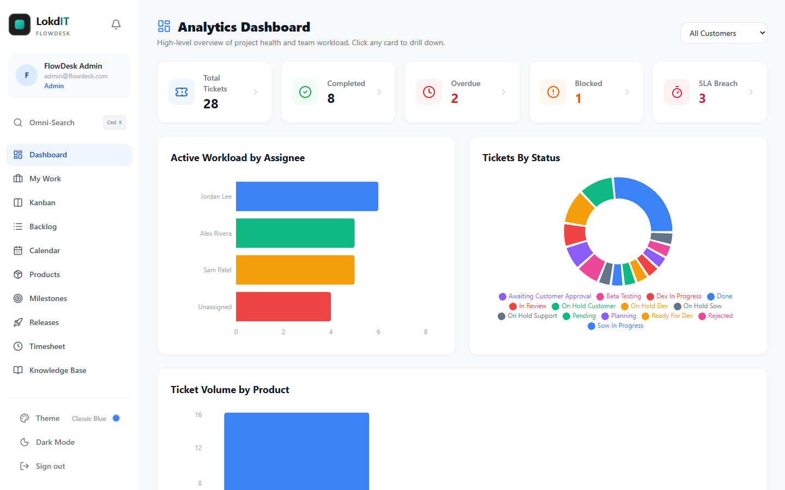

# FlowDesk

**Open-source ticketing, Kanban and project management for small teams.** Take requests in, triage them, plan the work, track time and SLAs, and ship releases, all in one app that runs on a free Supabase project and a free Vercel account.

[](LICENSE)




**Contents**

- [What is FlowDesk](#what-is-flowdesk)
- [Features](#features)
- [How it works](#how-it-works)
- [What you need](#what-you-need)
- [Quick start: from zero to your own deployment](#quick-start)
- [Default login](#default-login)
- [After you go live](#after-you-go-live)
- [Configuration](#configuration)
- [Local development](#local-development)
- [Tech stack](#tech-stack)
- [Project structure](#project-structure)
- [Documentation](#documentation)
- [Contributing and security](#contributing)
- [License](#license)
- [Credits](#credits)

---

## What is FlowDesk

FlowDesk is an open-source help desk and delivery tracker in one app, for small teams that support customers or internal locations **and** build what they ask for. Requests come in as tickets, get triaged, move across a Kanban board through planning, development, approval and release, and stay linked to milestones, releases, time logs and knowledge base articles along the way.

| Role | Typical user | Home page after sign-in |
|---|---|---|
| **Admin** | Runs FlowDesk: users, branches, products, SLA targets, approval gates, reports | Backlog |
| **Developer** | Works assigned tickets, logs time, ships releases | My Work |
| **Support desk** | Triages incoming requests and talks to requesters | Backlog, filtered to the triage queue |
| **Branch manager** | Submits and follows requests for their branch (location) | Support Portal |

There is no public sign-up: an admin creates every account, and each new user chooses their own password at first sign-in.

## Features

| Area | What you get |
|---|---|
| **Tickets** | Readable numbers (`FLD-0001`), seven types, four priorities and a 14-status workflow. Rich-text descriptions, acceptance criteria, comments with `@mentions` and staff-only internal notes, file attachments, watchers, linked and blocking tickets, project tickets with child tasks, PDF export. |
| **Planning** | Drag-and-drop Kanban board, a Backlog with filters and saved views, My Work, a Calendar with an assignee Timeline, Products, Milestones and Releases. |
| **Service management** | SLA targets per priority with response and resolution deadlines, approval gates for chosen status changes, a Support Portal for branch managers, and a Knowledge Base. |
| **Time tracking** | Live timers, manual time logs, estimated vs. billed hours (entered as hours or `1w 2d 4h` style) and a weekly Timesheet. |
| **Insights** | Ticket Dashboard, plus an admin-only Executive dashboard and Reports (SLA compliance, workload, aging tickets and more). |
| **Collaboration** | Live updates through Supabase Realtime, in-app notifications, presence avatars on tickets, and a `Ctrl+K` / `Cmd+K` command palette. |
| **Look and feel** | Light and dark mode, six color themes (Classic Blue, Rose Gold, Lavender, Sage, Peach, Orchid) and a simplified layout for phones. |
| **Administration** | Users and roles (admin, developer, support desk, branch manager), branches, audit logs, "view as" another role, and forced password resets. |

Full feature tour: [User Guide](docs/USER_GUIDE.md).

## How it works

FlowDesk has **no server of its own**. It is a React single-page app that talks directly to your own Supabase project:

```text
 Browser  ──>  FlowDesk (static files, served by Vercel or `npm run dev`)
                  │
                  └──>  Your Supabase project
                         • Postgres with Row Level Security on every table
                         • Auth (email + password)
                         • Storage (avatars, ticket attachments)
                         • Realtime (live boards, comments, notifications)
                         • Edge Function "admin-actions" (creating users, password changes)
```

The browser only ever holds Supabase's **public** key. Row Level Security in the database decides what each user can read or change, and the few actions that need full access run server-side in the `admin-actions` Edge Function. Details: [Architecture](docs/ARCHITECTURE.md).

**Built with** React 18, TypeScript, Vite 5, Tailwind CSS 3, Zustand, React Router, TipTap, dnd-kit, Recharts and FullCalendar, on Supabase (Postgres, Auth, Storage, Realtime, Edge Functions). Full list: [Tech stack](#tech-stack).

## What you need

| You need | Cost | Used for |
|---|---|---|
| [Node.js](https://nodejs.org/) **20 or newer** (check with `node -v`) | Free | Installing, building and running the Supabase CLI |
| [Git](https://git-scm.com/downloads) | Free | Getting the code |
| A [GitHub](https://github.com/signup) account | Free | Your own copy of the code, which Vercel deploys from |
| A [Supabase](https://supabase.com/dashboard) account | Free plan is enough | Database, sign-in, file storage, live updates |
| A [Vercel](https://vercel.com/signup) account | Free Hobby plan | Hosting the website |

No Docker needed. Plan for about 30 minutes. No prior Supabase or Vercel experience is assumed.

> [!TIP]
> **Never used GitHub, Supabase or Vercel?** Follow the **[FlowDesk Setup Guide](docs/SETUP_GUIDE.html)**, a click-by-click walkthrough with a progress tracker and a worksheet that fills in your own links. It lets you choose between two paths: **online** (Supabase + Vercel, for your whole team) or **on your own computer** (Supabase + localhost, no Vercel or GitHub account needed). GitHub shows the file as source code: download it (the **Download raw file** button) and open it in your browser.

> [!NOTE]
> Free Supabase projects are **paused after about a week without activity**. A paused project makes FlowDesk look broken until you click **Resume project** in the Supabase dashboard. Vercel's Hobby plan is for personal, non-commercial use; check [Vercel's pricing](https://vercel.com/pricing) if you run FlowDesk for a business.

---

<a id="quick-start"></a>

## Quick start: from zero to your own deployment

Six steps take you from nothing to FlowDesk running at your own Vercel address. Each step links to the full walkthrough in [docs/SETUP.md](docs/SETUP.md) and [docs/DEPLOY_VERCEL.md](docs/DEPLOY_VERCEL.md), which explain every dashboard setting and give a browser-only option for each command-line step.

### Step 1. Fork and clone the code

1. Open https://github.com/JeffTarlton/FlowDesk-Public and click **Fork**. Vercel will deploy from your fork.
2. Clone your fork and install the dependencies:

   ```bash
   git clone https://github.com/<your-username>/FlowDesk-Public.git
   cd FlowDesk-Public
   npm install
   ```

   On Windows, run the commands in this guide in **Command Prompt**. In PowerShell, `npm` and `npx` often fail with "running scripts is disabled on this system"; there, type `npm.cmd` and `npx.cmd` instead ([details](docs/TROUBLESHOOTING.md#npmps1-cannot-be-loaded-because-running-scripts-is-disabled-on-this-system)).

Details: [SETUP.md, step 1](docs/SETUP.md#1-get-the-code).

### Step 2. Create a Supabase project and its database

1. At https://supabase.com/dashboard, create a new project on the **Free** plan. **Save the database password** in your password manager, and pick the region closest to your users (it cannot be changed later).
2. Note your **project ref**, the random-looking part of `https://<project-ref>.supabase.co`.
3. Build the database. From the repository folder:

   ```bash
   npx supabase login
   npx supabase link --project-ref <project-ref>
   npx supabase db push
   ```

   `link` asks for the database password. `db push` applies the two files in `supabase/migrations/`, in order:

   | File | What it creates |
   |---|---|
   | `20260926000000_flowdesk_schema.sql` | All tables, functions, triggers, Row Level Security policies, storage buckets, Realtime settings, and default SLA targets and approval gates |
   | `20260926000100_seed_admin.sql` | The first account: **`admin@flowdesk.com`** / **`Password2026!`**, which must be changed at first sign-in |

   Prefer not to use the command line? Paste both files, in that order, into the dashboard's **SQL Editor** instead. Both are safe to run more than once.

Details: [SETUP.md, steps 2 and 3](docs/SETUP.md#2-create-a-free-supabase-project).

### Step 3. Deploy the `admin-actions` Edge Function

**Required.** Without it, nobody can finish their first sign-in, including the default admin.

```bash
npx supabase login
npx supabase functions deploy admin-actions --project-ref <project-ref> --no-verify-jwt
```

(If you ran `login` and `link` in step 2, the first line and `--project-ref <project-ref>` can be left out.) No command line? Paste the function into the dashboard editor instead: [SETUP.md, step 4, option A](docs/SETUP.md#option-a-supabase-dashboard-no-install).

- The name must be exactly `admin-actions`, and **JWT verification must be off** (the function checks every caller's token itself).
- There are no secrets to set: Supabase gives the function its URL and secret key automatically.
- Check it: opening `https://<project-ref>.supabase.co/functions/v1/admin-actions` in your browser should show `{"error":"Method not allowed"}`.

Details, including deploying from the dashboard editor: [SETUP.md, step 4](docs/SETUP.md#4-deploy-the-admin-actions-edge-function).

### Step 4. Lock down sign-in and copy your keys

In the Supabase dashboard:

1. **Authentication > Sign In / Providers**: turn **off** **Allow new users to sign up**. FlowDesk has no sign-up page; admins create every account.
2. **Authentication > URL Configuration**: set **Site URL** to `http://localhost:5173` for now and add `http://localhost:5173/**` under **Redirect URLs**. You will add your Vercel address in step 6.
3. Click **Connect** at the top of the project dashboard and copy two values:
   - the **Project URL**, like `https://abcdefghijklmnopqrst.supabase.co` (also under **Integrations > Data API**, or simply `https://<project-ref>.supabase.co`)
   - the **publishable key** (`sb_publishable_...`), or the legacy `anon` key (also under **Project Settings > API Keys**)

> [!WARNING]
> **Never use the secret key (`sb_secret_...`) or the `service_role` key in FlowDesk's settings.** Every `VITE_` variable is compiled into the JavaScript that every visitor downloads. FlowDesk never needs the secret key in the browser.

Details: [SETUP.md, steps 5 and 6](docs/SETUP.md#5-lock-down-authentication).

### Step 5. Run FlowDesk on your computer and sign in

1. Create your settings file and fill in the two values from step 4:

   ```bash
   cp .env.example .env.local
   ```

   (On Windows: `copy .env.example .env.local`.)

   ```bash
   VITE_SUPABASE_URL=https://abcdefghijklmnopqrst.supabase.co
   VITE_SUPABASE_ANON_KEY=sb_publishable_your_key_here
   ```

2. Start the app and open http://localhost:5173:

   ```bash
   npm run dev
   ```

3. Sign in as `admin@flowdesk.com` with `Password2026!`. The **Set Your Password** screen appears: choose a new password (at least 8 characters, with a number and a special character).

If you see **"FlowDesk isn't configured yet"**, a value in `.env.local` is missing (or the URL is not a valid address); fix it and restart `npm run dev`. A key that is present but wrong shows an "Invalid API key" alert at sign-in instead; see [Troubleshooting](docs/TROUBLESHOOTING.md#invalid-api-key-or-other-key-errors). `.env.local` is git-ignored, so your keys are never committed.

Details: [SETUP.md, steps 7 and 8](docs/SETUP.md#7-run-flowdesk-locally).

### Step 6. Deploy to Vercel

1. At https://vercel.com/new, sign in with GitHub and **Import** your `FlowDesk-Public` fork.
2. Leave the detected build settings as they are: framework **Vite**, build command `npm run build`, output directory `dist`.
3. Under **Environment Variables**, add the same two values as your `.env.local`, for **Production** and **Preview**:

   | Name | Value |
   |---|---|
   | `VITE_SUPABASE_URL` | Your Project URL |
   | `VITE_SUPABASE_ANON_KEY` | Your publishable or `anon` key |

4. Click **Deploy**. After a minute or two the site is live. On the project's **Overview** page, note the short address listed under **Domains**, like `https://your-project.vercel.app`. Use that one everywhere: the longer addresses with random letters belong to single deployments and may ask visitors to sign in to Vercel.
5. Back in Supabase, **Authentication > URL Configuration**: set **Site URL** to that address and add it again with `/**` at the end (for example `https://your-project.vercel.app/**`) to **Redirect URLs** (keep the localhost entry).
6. Open your Vercel address and sign in with the password you chose in step 5. It is the same database.

**You're live.** Every push to your fork's `main` branch now redeploys the site automatically.

Details, including custom domains and the Vercel Supabase integration: [DEPLOY_VERCEL.md](docs/DEPLOY_VERCEL.md).

---

## Default login

> [!IMPORTANT]
> - **Email:** `Admin@flowdesk.com` (not case sensitive)
> - **Password:** `Password2026!`
>
> This account is created by `supabase/migrations/20260926000100_seed_admin.sql`. Because the password is published here, FlowDesk **forces you to choose a new password at the first sign-in** (this needs the `admin-actions` Edge Function). Make sure it has been changed **before your FlowDesk is reachable on the internet**, and consider replacing it with an admin account under your own email address. Locked out? See [Reset the admin password](docs/SETUP.md#locked-out-reset-the-admin-password).

## After you go live

1. **Set up your workspace.** [Getting Started](docs/GETTING_STARTED.md) walks the first admin through branches, products, SLA targets, approval gates, inviting the team and a first ticket from intake to release.
2. **Harden the installation.** Work through the [deployment hardening checklist](SECURITY.md#deployment-hardening-checklist), and consider replacing the published default admin with an account under your own email ([how](docs/GETTING_STARTED.md#optional-replace-the-default-admin)).
3. **Keep it running.** Keep your fork up to date with **Sync fork** on GitHub. Vercel redeploys the website, but database and Edge Function changes are **not** deployed by Vercel; apply new files in `supabase/migrations/` with `npx supabase db push` and redeploy the function when it changes ([how](docs/ARCHITECTURE.md#9-changing-the-schema)).

Locked out of every admin account? [SETUP.md](docs/SETUP.md#locked-out-reset-the-admin-password) has a SQL snippet that resets the default admin.

## Configuration

All settings are environment variables: `.env.local` when running locally, **Settings > Environment Variables** on Vercel. See [.env.example](.env.example).

| Variable | Required | Description |
|---|---|---|
| `VITE_SUPABASE_URL` | Yes | Your Supabase Project URL. |
| `VITE_SUPABASE_ANON_KEY` | Yes | Your Supabase publishable key (`sb_publishable_...`) or legacy `anon` key. The name is historical; both kinds work. |
| `VITE_FULLCALENDAR_LICENSE_KEY` | No | A [FullCalendar Premium](https://fullcalendar.io/license) key for the Calendar's Timeline view. Without one, everything works and the Timeline view shows a small license notice. |

Values are baked into the site when it is built, so **restart `npm run dev` or redeploy on Vercel after changing one**. If you connect Supabase to Vercel with the [Supabase integration](docs/DEPLOY_VERCEL.md#optional-the-vercel-supabase-integration), FlowDesk also accepts its `NEXT_PUBLIC_SUPABASE_*` names.

## Local development

| Command | What it does |
|---|---|
| `npm run dev` | Starts the dev server at http://localhost:5173 |
| `npm run build` | Type-checks and builds the production site into `dist/` (what Vercel runs) |
| `npm run preview` | Serves the built `dist/` folder at http://localhost:4173 |
| `npm run lint` | Runs ESLint |

To work on the SQL or the Edge Function without touching a hosted project, run the whole Supabase stack locally with Docker (`npx supabase start`). See [SETUP.md](docs/SETUP.md#optional-run-supabase-locally-with-docker).

## Tech stack

| Layer | Technology |
|---|---|
| UI | [React](https://react.dev) 18, [TypeScript](https://www.typescriptlang.org) 5.6 |
| Build and dev server | [Vite](https://vite.dev) 5 |
| Styling | [Tailwind CSS](https://tailwindcss.com) 3 with `@tailwindcss/typography`, [lucide-react](https://lucide.dev) icons |
| State and routing | [Zustand](https://zustand.docs.pmnd.rs) 5, [React Router](https://reactrouter.com) 6 |
| Backend | [Supabase](https://supabase.com): Postgres with Row Level Security, Auth, Storage, Realtime, and one Edge Function (Deno) |
| Client library | [`@supabase/supabase-js`](https://supabase.com/docs/reference/javascript) 2 |
| Rich text | [TipTap](https://tiptap.dev) 3 (mentions, images), sanitized with [DOMPurify](https://github.com/cure53/DOMPurify) |
| Drag and drop | [dnd-kit](https://dndkit.com) |
| Calendar and timeline | [FullCalendar](https://fullcalendar.io) 6 (the Timeline view uses a separately licensed premium plugin) |
| Charts | [Recharts](https://recharts.org) 3 |
| Other | [cmdk](https://cmdk.paco.me) (command palette), [date-fns](https://date-fns.org), [html2pdf.js](https://github.com/eKoopmans/html2pdf.js) (PDF export), [react-hot-toast](https://react-hot-toast.com) |
| Hosting | [Vercel](https://vercel.com) or any static host (`vercel.json` adds the single-page-app rewrite) |

## Project structure

```text
FlowDesk-Public/
├── src/
│   ├── pages/            One component per route (Kanban, Backlog, Admin, ...)
│   ├── components/       Shared UI (ticket panel, cards, modals, theme picker, ...)
│   ├── layouts/          App shell with the sidebar and mobile navigation
│   ├── store/            Zustand stores (tickets, auth, themes, ...)
│   ├── hooks/, utils/    Shared logic
│   ├── lib/supabase.ts   The Supabase client and environment checks
│   ├── types/            Shared TypeScript types
│   ├── themes.css        Color theme palettes
│   └── index.css         Global styles
├── supabase/
│   ├── migrations/       Database schema and default admin (applied in order)
│   ├── functions/admin-actions/   The Edge Function
│   └── config.toml       Settings for the local Supabase stack
├── docs/                 Setup, deployment, user and architecture guides
├── .env.example          Template for .env.local
└── vercel.json           Single-page-app routing for Vercel
```

## Documentation

| Guide | For | Covers |
|---|---|---|
| [Setup Guide (beginners)](docs/SETUP_GUIDE.html) | First-time installers new to GitHub, Supabase and Vercel | A click-by-click walkthrough from zero to a working FlowDesk, online with Vercel or on your own computer (download the HTML file and open it in your browser) |
| [Setup](docs/SETUP.md) | Whoever installs FlowDesk | Every step in detail, with no-install options and local Supabase |
| [Deploy to Vercel](docs/DEPLOY_VERCEL.md) | Whoever installs FlowDesk | Hosting, environment variables, custom domains, updates |
| [Getting Started](docs/GETTING_STARTED.md) | The first admin | Workspace setup, inviting users, roles and permissions, a first ticket |
| [User Guide](docs/USER_GUIDE.md) | Everyone | Every page and feature |
| [Troubleshooting](docs/TROUBLESHOOTING.md) | Everyone | Error messages and how to fix them |
| [Known Issues](docs/KNOWN_ISSUES.md) | Everyone, especially contributors | Current limitations and bugs, and where to start fixing them |
| [Architecture](docs/ARCHITECTURE.md) | Developers | Code layout, data model, security model, changing the schema |
| [Changelog](CHANGELOG.md) | Everyone | What changed in each release |
| [Contributing](CONTRIBUTING.md) | Contributors | Development setup, coding conventions, pull requests |
| [Security policy](SECURITY.md) | Everyone who deploys FlowDesk | Reporting vulnerabilities, deployment hardening checklist |
| [Code of Conduct](CODE_OF_CONDUCT.md) | Everyone | Community standards |
| [License](LICENSE) | Everyone | The MIT License |

<a id="contributing"></a>

## Contributing and security

- **Contributing:** issues and pull requests are welcome. Start with [CONTRIBUTING.md](CONTRIBUTING.md), and please follow the [Code of Conduct](CODE_OF_CONDUCT.md).
- **Security:** please report vulnerabilities privately as described in [SECURITY.md](SECURITY.md), not in a public issue.

## License

FlowDesk is released under the [MIT License](LICENSE). The optional FullCalendar Premium plugin used by the Calendar's Timeline view is licensed separately by FullCalendar (see [SETUP.md](docs/SETUP.md#optional-fullcalendar-timeline-license-key)).

## Credits

FlowDesk was created by **Jeff Tarlton** ([@JeffTarlton](https://github.com/JeffTarlton)) and is published by [LokdIT](https://www.lokdit.net).

Running FlowDesk under your own name? Replace `src/components/LokdITLogo.tsx` and `public/favicon.svg` with your own logo.
