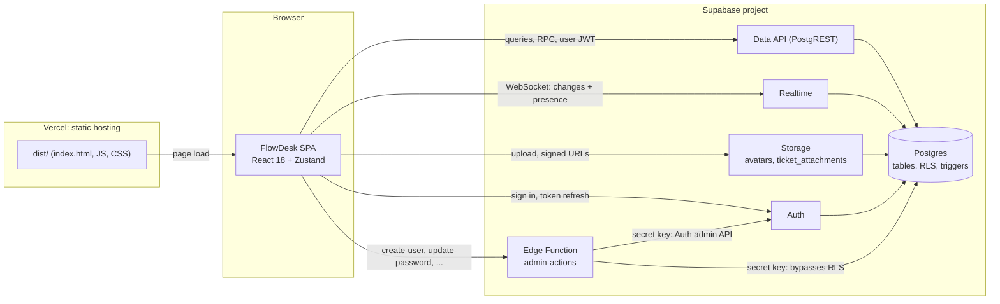
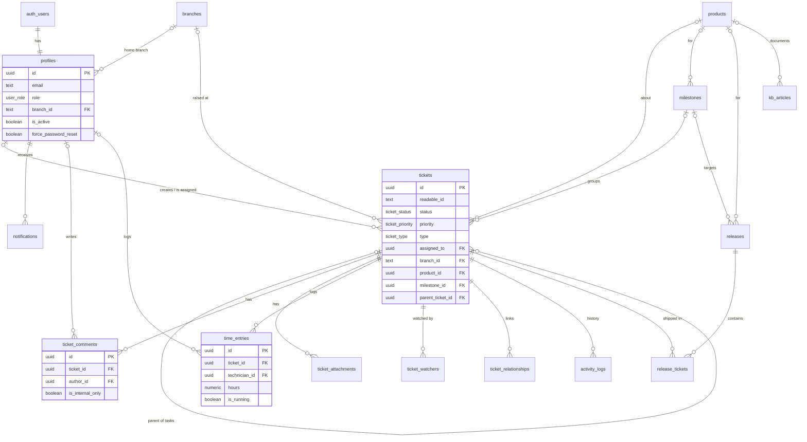

# FlowDesk architecture

This document is for developers who want to understand, change or extend FlowDesk. If you only want to run it, start with [SETUP.md](SETUP.md).

Contents:

1. [Overview](#1-overview)
2. [Frontend structure](#2-frontend-structure)
3. [State management](#3-state-management)
4. [Routing and role guards](#4-routing-and-role-guards)
5. [Data model](#5-data-model)
6. [Security model](#6-security-model)
7. [Realtime](#7-realtime)
8. [Database triggers](#8-database-triggers)
9. [Changing the schema](#9-changing-the-schema)
10. [Local development with the Supabase CLI](#10-local-development-with-the-supabase-cli)

---

## 1. Overview

FlowDesk is a single-page application (SPA). There is no application server of its own:

- **The browser** runs the React app. It talks to Supabase directly with `@supabase/supabase-js`, using only the public key (the publishable key or the legacy `anon` key) plus the signed-in user's access token.
- **Supabase** provides everything on the server side: Auth, the Postgres database (exposed through the PostgREST Data API), Realtime, Storage, and one Edge Function (`admin-actions`) for the few operations that need elevated rights.
- **Vercel** (or any static host) only serves the built files from `dist/`. `vercel.json` rewrites every path to `index.html` so deep links such as `/kanban` work with React Router.



Because the browser talks to the database directly, **Row Level Security (RLS) is the real access control**. The role checks in the React code decide what to show; the policies in Postgres decide what a user can actually read or change. See [Security model](#6-security-model).

### Tech stack

| Layer | Library / service |
|---|---|
| UI | React 18, TypeScript, Tailwind CSS 3 (`@tailwindcss/typography`), `lucide-react` icons |
| Build | Vite 5 (`npm run build` runs `tsc -b && vite build`) |
| State | Zustand 5 |
| Routing | React Router 6 (`BrowserRouter`) |
| Rich text | TipTap 3 (StarterKit, Image, Mention), sanitized with DOMPurify before rendering |
| Drag and drop | dnd-kit (Kanban) |
| Charts | Recharts |
| Calendar | FullCalendar 6 (the Timeline view uses the premium `resource-timeline` plugin; see `VITE_FULLCALENDAR_LICENSE_KEY` in `.env.example`) |
| PDF export | html2pdf.js (loaded on demand) |
| Command palette | cmdk |
| Toasts | react-hot-toast (`<Toaster />` is mounted in `src/main.tsx`) |
| Backend | Supabase: Auth, Postgres, PostgREST, Realtime, Storage, Edge Functions (Deno) |

---

## 2. Frontend structure

```text
src/
  main.tsx              Entry point. Renders <App /> or, if the Supabase env vars are
                        missing or invalid, <SetupRequired />. Mounts the <Toaster />.
  App.tsx               Router, role guards (RequireRole), role-based landing page,
                        Ctrl/Cmd+K command palette shortcut.
  layouts/
    AppLayout.tsx       Shell for every signed-in page: sidebar, mobile layout,
                        forced password reset gate, "view as" banner, session recovery.
  pages/                One file per route (see section 4).
  components/           Shared UI: ticket detail panel, modals, Kanban column, cards,
                        rich-text editor, notification bell, presence avatars, ...
    mention/            TipTap @mention suggestion list.
  store/                Zustand stores, one per domain (see section 3).
  hooks/                usePinnedTickets, useSavedViews (localStorage),
                        useSessionRecovery (re-fetch after idle).
  lib/
    supabase.ts         The single Supabase client, env var resolution, fetch timeout,
                        Realtime reconnect settings.
    edgeFunctionError.ts  Turns "function not reachable" errors into a helpful message.
  types/index.ts        Hand-written row types, status/priority/type unions and the
                        Kanban COLUMNS mapping.
  utils/timeTracker.ts  Parses "1w 2d 4h" style durations (1w = 40h, 1d = 8h).
  index.css             Tailwind layers and global styles.
  themes.css            Color themes as CSS variables, selected by data-theme on <html>.
```

### Pages

| File | Route | What it does |
|---|---|---|
| `Login.tsx` | `/login` | Email and password sign-in (`signInWithPassword`). There is no sign-up form. |
| `Dashboard.tsx` | `/dashboard` | Ticket analytics with clickable metric cards. |
| `MyWork.tsx` | `/my-work` | The signed-in user's assigned tickets, with pinning. |
| `KanbanBoard.tsx` | `/kanban` | Drag-and-drop board. Columns come from `COLUMNS` in `types/index.ts`; the On-Hold column groups the four `on_hold_*` statuses. |
| `Backlog.tsx` | `/backlog` | Filterable, sortable ticket list with saved views and "load more". |
| `CalendarTimeline.tsx` | `/calendar` | FullCalendar month/week views and a per-assignee timeline. |
| `Portal.tsx` | `/portal` | Support portal for branch managers and the support desk (uses `BranchRequestModal` and `CustomerTicketDetail`). |
| `ProductsCatalog.tsx` | `/products` | Products and the tickets for each. |
| `MilestonesPage.tsx` | `/milestones` | Milestones with progress. |
| `ReleasesPage.tsx` | `/releases` | Releases and the tickets in each. |
| `TimesheetPage.tsx` | `/timesheet` | Weekly hours grid from `time_entries`. |
| `KnowledgeBase.tsx` | `/knowledge-base` | Articles with categories, tags and drafts. |
| `ExecutiveDashboard.tsx` | `/executive` | Admin KPIs and charts over a date range. |
| `ReportsPage.tsx` | `/reports` | Admin reports with copy and PDF export. |
| `Admin.tsx` | `/admin` | Tabs: Users, All Tickets, Analytics, Branches, Audit Logs, Products, SLA, Gates. |

### Key components

| Component | Role |
|---|---|
| `TicketDetailPanel.tsx` | The slide-over used everywhere a ticket is opened: fields, status changes (with approval gate checks), comments and internal notes, @mentions, attachments, time tracking, watchers, linked tickets, activity feed, presence, PDF export. It is the largest file in the app. |
| `NewTicketModal.tsx` | Creates tickets (and optional first attachment). |
| `RichTextEditor.tsx` | TipTap editor. Files dropped on it or picked with its file button are uploaded to the `ticket_attachments` bucket and inserted as public URLs. |
| `ForcePasswordResetModal.tsx` | The "Set Your Password" screen. Calls `admin-actions` (`update-password`). |
| `NewUserModal.tsx`, `EditUserModal.tsx` | Admin user management. `NewUserModal` generates a temporary password and calls `admin-actions` (`create-user`). |
| `NotificationDropdown.tsx` | The bell. Subscribes to the user's notifications through Realtime. |
| `CommandPalette.tsx` | Ctrl/Cmd+K search over loaded tickets and quick navigation. |
| `SetupRequired.tsx` | Shown instead of the app when `VITE_SUPABASE_URL` / `VITE_SUPABASE_ANON_KEY` are missing. |
| `MobileDashboard.tsx`, `MobileTaskCard.tsx` | The layout used below the `md` breakpoint (768 px): a ticket list plus a bottom navigation bar. |

### The Supabase client (`src/lib/supabase.ts`)

- **URL:** `VITE_SUPABASE_URL`, falling back to `NEXT_PUBLIC_SUPABASE_URL`.
- **Key:** the first non-empty of `VITE_SUPABASE_ANON_KEY`, `VITE_SUPABASE_PUBLISHABLE_KEY`, `VITE_SUPABASE_PUBLISHABLE_DEFAULT_KEY`, `NEXT_PUBLIC_SUPABASE_ANON_KEY`, `NEXT_PUBLIC_SUPABASE_PUBLISHABLE_KEY`, `NEXT_PUBLIC_SUPABASE_PUBLISHABLE_DEFAULT_KEY`. A legacy `anon` JWT and a new `sb_publishable_...` key both work.
- The `NEXT_PUBLIC_*` names exist because the Vercel and Supabase integration sets them. `vite.config.ts` sets `envPrefix: ['VITE_', 'NEXT_PUBLIC_']`, so **every** variable with either prefix is embedded in the public JavaScript bundle. Never give a secret one of these prefixes.
- If the URL or key is missing, `isSupabaseConfigured` is `false` and `main.tsx` renders `SetupRequired` instead of the app.
- Every request has a 15-second timeout. Realtime sends a heartbeat every 15 seconds and reconnects with backoff (1 s, 2 s, 5 s, then 10 s).
- The session is persisted by supabase-js in browser storage and refreshed automatically.

---

## 3. State management

Each domain has its own Zustand store in `src/store/`. Stores hold data and the async actions that load and change it; components select what they need with `useXStore((s) => s.field)` or destructuring. There is no global cache library: stores call Supabase directly and update their state optimistically where it matters (for example Kanban moves).

| Store | Owns | Tables / services it uses |
|---|---|---|
| `useAuthStore` | Auth user, `profile`, "view as" state (`originalProfile`), `initialize()`, `signOut()`. Also validates the session when a tab regains focus after 2+ minutes. Exports `isPasswordResetPending()`. | Auth, `profiles` |
| `useTicketStore` | The shared ticket list (50 per page, `loadMoreTickets`), status and field updates, watchers, admin/customer approvals, the `public:tickets` Realtime channel. Writes an `activity_logs` row for tracked changes. | `tickets`, `ticket_watchers`, `activity_logs` |
| `useAdminStore` | Admin panel data: all users, **all** tickets (not paged), branches, audit logs; role and flag updates; permanent delete; force password reset. | `profiles`, `tickets`, `branches`, `audit_logs`, RPC `delete_user_officially`, `admin-actions` |
| `useApprovalStore` | Approval gates and `canTransition(ticket, newStatus)`, the check the Kanban board and the ticket panel run before a status change. | `approval_gates` |
| `useSlaStore` | SLA policies per priority. | `sla_policies` |
| `useProductStore` | Products (create, update, archive). | `products` |
| `useMilestoneStore` | Milestones and their ticket counts. | `milestones`, `tickets` |
| `useReleaseStore` | Releases and the tickets in each. | `releases`, `release_tickets` |
| `useRelationshipStore` | Linked tickets for the open ticket. | `ticket_relationships`, `activity_logs` |
| `useKbStore` | Knowledge base articles, search text and category filter. | `kb_articles` |
| `useNotificationStore` | Notifications, unread count, the per-user Realtime channel. | `notifications` |
| `usePresenceStore` | Who is viewing which ticket (Realtime Presence, no table). | Realtime |
| `useTimerStore` | The user's running timer (start, stop, discard). | `time_entries`, `tickets`, `activity_logs` |
| `useThemeStore` | Light/dark mode and color theme, saved in `localStorage` (`theme`, `color-theme`). An inline script in `index.html` applies them before React loads to avoid a flash. | none |

Some components also query Supabase directly for data that only they use, for example `TicketDetailPanel` (comments, attachments, time entries, activity), `Portal` and `BranchRequestModal` (portal tickets and requests) and `BranchInfoPanel` (a branch summary inside the ticket panel).

Per-browser preferences that are not shared between devices live in `localStorage`: saved Backlog views (`useSavedViews`), pinned tickets (`usePinnedTickets`), theme and mode.

### Session recovery

Browsers throttle background tabs, so WebSockets drop and tokens expire while a tab is hidden. `useAuthStore` dispatches a `supabase:session-recovered` window event on `SIGNED_IN` and `TOKEN_REFRESHED`, and after it re-validates the session when a tab returns from 2+ minutes in the background. `useSessionRecovery` (mounted once in `AppLayout`) listens for that event, re-fetches the ticket, admin and notification stores, re-subscribes the Realtime channels and re-joins the presence room.

---

## 4. Routing and role guards

Routing lives in `src/App.tsx`. Every route except `/login` renders inside `AppLayout`, which redirects to `/login` when nobody is signed in. Unknown paths redirect to `/`.

`RequireRole` wraps each page and handles, in order:

1. No profile loaded: redirect to `/login`.
2. `profile.is_active === false`: show "Account Deactivated".
3. A role the app has no screens for (the database role `customer`): show "No Role Assigned".
4. A role not in the page's `allowedRoles`: redirect to `/`.

| Route | Allowed roles | In the sidebar for |
|---|---|---|
| `/dashboard` | admin, developer, support_desk, branch_manager | same |
| `/my-work` | admin, developer, support_desk | same |
| `/kanban` | admin, developer, support_desk, branch_manager | same |
| `/backlog` | admin, developer, support_desk | same |
| `/calendar` | admin, developer, support_desk | same |
| `/portal` | support_desk, branch_manager | same |
| `/products` | all four | everyone |
| `/milestones`, `/releases`, `/knowledge-base` | all four | admin, developer, support_desk |
| `/timesheet` | admin, developer, support_desk | same |
| `/executive`, `/reports`, `/admin` | admin | admin |

`/` is a redirect: admin goes to `/backlog`, developer to `/my-work`, support_desk to `/backlog?filter=triage`, branch_manager to `/dashboard`. Right after signing in, `Login.tsx` sends branch managers to `/portal` and everyone else to `/`.

Two gates sit above the routes in `AppLayout`:

- **Forced password reset.** If the signed-in user's profile has `force_password_reset = true`, `AppLayout` renders only `ForcePasswordResetModal`, on every screen size. The command palette is disabled too. The flag can only be cleared by the `admin-actions` function after the password has actually changed (see [section 6](#6-security-model)).
- **"View as" (impersonation).** An admin can preview the app as another user with the **Impersonate User** button in Admin > Users. This only swaps `profile` in `useAuthStore` so the menus and pages match that role. Every request still uses the admin's own session, so RLS still applies the admin's permissions. It is a UI preview, not a security boundary. Reloading the page ends it.

The guards are for user experience. Typing a URL, or calling the API directly, is still limited by RLS.

---

## 5. Data model

The whole schema is in [`supabase/migrations/20260926000000_flowdesk_schema.sql`](../supabase/migrations/20260926000000_flowdesk_schema.sql). The default admin account is created by [`supabase/migrations/20260926000100_seed_admin.sql`](../supabase/migrations/20260926000100_seed_admin.sql).

### Enum types

| Type | Values |
|---|---|
| `user_role` | `admin`, `developer`, `support_desk`, `branch_manager`, `customer` (no UI; the default for accounts not created by an admin) |
| `ticket_status` | `pending`, `planning`, `sow_in_progress`, `awaiting_customer_approval`, `ready_for_dev`, `dev_in_progress`, `in_review`, `beta_testing`, `done`, `rejected`, `on_hold_customer`, `on_hold_dev`, `on_hold_support`, `on_hold_sow` |
| `ticket_priority` | `low`, `medium`, `high`, `critical` |
| `ticket_type` | `bug`, `feature_request`, `project`, `task`, `documentation`, `improvement`, `professional_service` |

### Tables

| Table | Purpose | Key relationships |
|---|---|---|
| `profiles` | One row per Auth user: name, email, role, branch, `is_active`, `force_password_reset`, avatar. | `id` references `auth.users` (cascade delete); `branch_id` references `branches`. |
| `branches` | Locations or teams. The id is free text chosen by the admin (for example `HQ-001`). | Referenced by `profiles` and `tickets`. |
| `products` | Product catalog. Archived (`status = 'archived'`), never deleted. | Referenced by `tickets`, `milestones`, `releases`, `kb_articles`. |
| `milestones` | Goals with a target date and status. | Optional `product_id`; tickets point to a milestone. |
| `tickets` | The core record: title, rich-text description, acceptance criteria, type, priority, status, assignee, customer name/email, branch, product, dates, estimates, SLA deadlines and breach flags, approvals, blocked flag. `readable_id` (`FLD-0001`, ...) comes from `ticket_seq`. | `created_by`, `assigned_to` reference `profiles`; `branch_id`, `product_id`, `milestone_id`; `parent_ticket_id` (a project's tasks, cascade delete); `blocked_by_ticket_id`. |
| `ticket_comments` | Comments and staff-only internal notes (`is_internal_only`). | `ticket_id` (cascade), `author_id`. |
| `ticket_attachments` | Metadata for files in the `ticket_attachments` bucket (`file_path`). | `ticket_id` (cascade), `uploaded_by`. |
| `time_entries` | Manual time logs and live timers (`is_running`). A unique partial index allows one running timer per person. | `ticket_id` (cascade), `technician_id`. |
| `ticket_watchers` | Who follows a ticket. Unique per ticket and user. | `ticket_id`, `user_id` (both cascade). |
| `ticket_relationships` | Links between tickets: `related_to`, `duplicate_of` / `duplicated_by`, `blocks` / `blocked_by`. A trigger keeps the mirror row in sync. | `source_ticket_id`, `target_ticket_id` (cascade). |
| `activity_logs` | The human-readable feed in the ticket panel, written by the app. | `ticket_id` (cascade), `actor_id`. |
| `notifications` | In-app notifications (`status_change`, `assignment`, `new_comment`, `mention`, `system`). Kept for 30 days. | `user_id` (cascade), `actor_id`, `ticket_id`. |
| `releases` | Versions with a status and release date. | Optional `product_id`, `milestone_id`. |
| `release_tickets` | Tickets included in a release. | `release_id`, `ticket_id` (both cascade). |
| `kb_articles` | Knowledge base articles with category, tags and `is_published`. A generated `fts` column has a GIN index for full-text search. | Optional `product_id`, `author_id`. |
| `sla_policies` | Response and resolution targets (hours) per priority. Four rows are seeded. | Read by the SLA triggers. |
| `approval_gates` | Status transitions that need admin and/or customer approval. Three rows are seeded. | Read by `useApprovalStore`. |
| `audit_logs` | Role changes, activations, ticket deletions and user deletions. Written only by triggers and `delete_user_officially`. | `actor_id` references `auth.users`. |

Deleting a user removes their `auth.users` row, which cascades to `profiles`. Every other reference to a profile is either `ON DELETE SET NULL` (history is kept and shown as a deleted user) or `ON DELETE CASCADE` (rows that mean nothing without the user, such as their notifications and watch list).

### Entity relationship diagram (main tables)



### Names the frontend depends on

Some database names are referenced as strings in the React code. Renaming them breaks the app:

- Foreign key names used as PostgREST embed hints, for example `profiles!tickets_assigned_to_fkey`.
- `idx_one_running_timer_per_tech` (the UI matches it to explain that a timer is already running).
- `no_self_relationship` (the UI matches it when a ticket is linked to itself).
- Bucket names `avatars` and `ticket_attachments`, the RPC `delete_user_officially`, and the Edge Function name `admin-actions`.

### Storage

| Bucket | Public | Limits | Object paths |
|---|---|---|---|
| `avatars` | yes | 5 MB, images only | `<user id>-<random>.<ext>` |
| `ticket_attachments` | yes | 50 MB, any type | `<user id>/<timestamp>-<random>_<name>` (attachment panel), `comment-attachments/<timestamp>-<random>_<name>` (images and files inserted in the rich-text editor) |

Both buckets are public because the app stores public URLs: `profiles.avatar_url`, and links inside ticket descriptions, comments and articles. The attachment panel downloads through short-lived signed URLs (60 seconds). See [SECURITY.md](../SECURITY.md#6-attachments-are-public-by-url) for what "public" means here.

---

## 6. Security model

### Principles

- The browser only ever holds the **public** key. Everything it can do is limited by grants and RLS in Postgres.
- The `anon` role (not signed in) has **no** access: all table privileges and the helper functions are revoked from `anon`. FlowDesk has no public pages.
- Signed-in users reach the tables as the `authenticated` role, and RLS decides which rows they see and change.
- Anything that needs the secret (service role) key runs in the `admin-actions` Edge Function, which checks the caller itself.

### Role helper functions

Policies do not query `profiles` directly (that would recurse through the `profiles` policies). They call three helpers:

| Function | Returns |
|---|---|
| `get_my_role()` | The caller's role |
| `get_my_branch_id()` | The caller's branch |
| `get_my_email()` | The caller's profile email, lower-cased |

All three are `STABLE SECURITY DEFINER` SQL functions with `search_path` pinned to `''`, and all three return `NULL` for signed-out callers **and for deactivated profiles** (`is_active = false`). Because nearly every policy requires a non-null role, deactivating a user blocks their access to tickets and all other shared data at the database level, even though their Auth session is still technically valid. They can still read their own profile row, which is how the app knows to show "Account Deactivated". Policies wrap the calls as `(SELECT public.get_my_role())` so Postgres evaluates them once per statement instead of once per row.

Terms used in the policies:

- **Member**: a signed-in user with an active profile (`get_my_role() IS NOT NULL`).
- **Staff**: `admin`, `developer`, `support_desk`.
- **Team**: staff plus `branch_manager`.
- **Customer**: sees only tickets whose `customer_email` matches their profile email, plus public comments and attachments on them.

### Policy summary

| Table | Read | Write |
|---|---|---|
| `profiles` | Own row; the team sees everyone | Own row; admins any row. Privileged columns are guarded by a trigger (below). No INSERT or DELETE policy: rows are created by `handle_new_user` and removed by `delete_user_officially`. |
| `tickets` | Team: all. Customer: own tickets by email | Insert: team, as themselves (admins may set any `created_by`). Update: staff; branch managers only tickets of their own branch. Delete: staff. |
| `ticket_comments` | Staff: all. Members: public comments on tickets they can see | Insert: members, as themselves, on tickets they can see. No UPDATE/DELETE policy (deletes go through `admin-actions`). |
| `ticket_attachments` | Members, on tickets they can see | Insert: as themselves, on a visible ticket, and `file_path` must be in their own `<user id>/` folder (admins exempt). Delete: uploader or staff. |
| `time_entries` | Team: all. Others: own | Insert: team, own entries. Update/Delete: owner or staff. |
| `notifications` | Own (active users only) | Update/Delete: own. Insert: only `mention` notifications, by team members, as themselves, on a visible ticket. All other types come from triggers. |
| `ticket_watchers`, `ticket_relationships`, `release_tickets` | Team | Watchers: team. Relationships: staff. Release tickets: admin, developer. |
| `activity_logs` | Members, on tickets they can see | Insert: team, as themselves. |
| `branches`, `products`, `sla_policies`, `approval_gates` | Members | Admins (products are archived, never deleted). |
| `milestones` | Members | Team. |
| `releases` | Members | Admin, developer. |
| `kb_articles` | Members: published. Staff: all, including drafts | Staff. |
| `audit_logs` | Admins | Nobody through the API (written by `SECURITY DEFINER` code). |

Sub-selects such as `EXISTS (SELECT 1 FROM public.tickets ...)` run under the caller's own RLS, so "tickets they can see" is always decided by the `tickets` policies.

### Guard triggers

RLS works on rows, not columns. Two `BEFORE` triggers add column-level rules for requests that come through the API (`current_user` is `authenticated` or `anon`). Trusted paths pass through: `SECURITY DEFINER` functions (run as their owner), the Edge Function (`service_role`) and the SQL Editor (`postgres`).

- **`guard_profile_privileged_columns`**: only an admin may change a profile's `id`, `email`, `role`, `is_active`, `force_password_reset` or `branch_id`, including their own. This stops a user from promoting themselves to admin or skipping the forced password reset with a direct API call.
- **`guard_ticket_privileged_columns`**: only an admin may grant `admin_approved` (on insert, or false to true on update; anyone who can edit the ticket may revoke it), and `readable_id` can never change. `set_readable_ticket_id` also ignores any `readable_id` sent through the API, so nobody can claim a ticket number.

### Accounts and sign-up

- `handle_new_user` (a trigger on `auth.users`) creates every new profile as an **inactive `customer`**. An account created outside the Admin panel, for example through the public sign-up endpoint if it is left enabled, therefore has no access until an admin activates it and gives it a role.
- `supabase/config.toml` disables sign-ups for the local stack. On a hosted project you must turn sign-ups off yourself; see [SECURITY.md](../SECURITY.md#deployment-hardening-checklist).
- `delete_user_officially(target_user_id)` is the only user-deletion path. It checks that the caller is an active admin and not deleting themselves, unassigns the user's tickets, discards a running timer, deletes the Auth user (cascading to the profile) and writes an audit log row.

### The `admin-actions` Edge Function

Source: [`supabase/functions/admin-actions/index.ts`](../supabase/functions/admin-actions/index.ts). It exists because some operations need the secret key, which must never reach the browser:

| Action | Who may call it | What it does |
|---|---|---|
| `create-user` | Admins | Creates an Auth user with a temporary password (email pre-confirmed) and upserts an active profile with the chosen role and branch and `force_password_reset = true`. The role must be one of `admin`, `developer`, `support_desk`, `branch_manager`. If the email already exists, it only recovers accounts whose profile is missing or inactive; it never takes over an active user. |
| `update-password` | The user themselves (`user_id` must equal the caller) | Rejects the published default password and weak passwords (at least 8 characters, a number and a special character), updates the password, then clears `force_password_reset`. Because the guard trigger blocks users from clearing that flag themselves, the first-login reset cannot be skipped from the browser. |
| `admin-force-password-reset` | Admins | Sets another user's password and sets `force_password_reset = true`. |
| `delete-comment` | Admins, or the comment's author | Deletes a comment (there is no DELETE policy on `ticket_comments`). |

Every request goes through the same checks before an action runs:

1. The `Authorization: Bearer <access token>` header must hold a valid user token, verified with `auth.getUser(token)`.
2. The caller must have a profile, and it must be active.
3. The action's own role or ownership check (table above).

Other details:

- It reads the secret key from `SUPABASE_SECRET_KEYS` (the `default` entry, new API keys) and falls back to `SUPABASE_SERVICE_ROLE_KEY` (legacy). Both are injected by Supabase; there is nothing to configure.
- Because the function authenticates the caller itself, `supabase/config.toml` sets `verify_jwt = false` for it. Leaving the platform's JWT check on also works.
- Errors are returned as **HTTP 200** with `{ "error": "..." }`, because `supabase.functions.invoke()` discards the body of non-2xx responses. The intended status code is written to the function logs.

### Storage policies

The buckets are public, so files are served by URL without any policy. The `storage.objects` policies control everything else:

- **Read** (needed for signed URLs, listing and removal): any member for `avatars`; for `ticket_attachments`, staff, the uploader, or anyone who can see an attachment row with that `file_path`. There is deliberately no anonymous read policy, so nobody can list the buckets.
- **Upload**: avatars must be named `<your user id>-...`; any member may upload to `ticket_attachments`.
- **Update**: the file's owner or an admin.
- **Delete**: the owner or an admin; developers and support desk may also delete ticket attachments.

### Other safeguards

- All functions pin `search_path` to `''` and schema-qualify every reference.
- Rich text (descriptions, comments, articles, activity) is sanitized with DOMPurify before it is rendered with `dangerouslySetInnerHTML`.
- **Approval gates are enforced in the browser**, by `useApprovalStore.canTransition()`. The database stores the gates but does not block a status change made directly through the API. Only granting `admin_approved` is enforced server-side (by the ticket guard trigger).

---

## 7. Realtime

The schema adds three tables to the `supabase_realtime` publication. Realtime applies RLS to each subscriber, so users only receive changes to rows they can read.

| Channel | Source | Events | Used for |
|---|---|---|---|
| `public:tickets` | `useTicketStore.subscribeToTickets()` (Backlog, Kanban, My Work) | `*` on `tickets` | Patches the shared ticket list in place. |
| `public:notifications:<user id>` | `useNotificationStore` (the bell) | `INSERT` on `notifications`, filtered by `user_id` | New notifications and the unread count. |
| `admin:ticket_comments:<ticket id>` | `TicketDetailPanel` | `INSERT` and `DELETE` on `ticket_comments`, filtered by `ticket_id` | Live comment feed. |
| `public:ticket_comments:<ticket id>` | `CustomerTicketDetail` (portal) | `INSERT` on `ticket_comments`, filtered by `ticket_id` | Live comment feed. |
| `ticket-presence:<ticket id>` | `usePresenceStore` | Presence (no table) | Avatars of the people viewing the same ticket. |

Notes:

- `ticket_comments` has `REPLICA IDENTITY FULL`, which Supabase requires for filtering `DELETE` events by a column other than the primary key.
- Supabase does not apply RLS to `DELETE` change events (Postgres cannot check access to a row that no longer exists). The app only uses them to remove a row by id.
- The channels are public Realtime channels (not `private: true`). Keep **Allow public access** turned on in the project's Realtime settings; turning it off allows private channels only, and the presence avatars stop working.
- If you add a table that needs live updates, add it to the publication in a migration:

  ```sql
  ALTER PUBLICATION supabase_realtime ADD TABLE public.your_table;
  ```

---

## 8. Database triggers

Postgres fires triggers with the same timing and event in **alphabetical order of their names**. The schema relies on this in a few places (noted below), so choose names for new triggers with care.

### `tickets`

| Trigger | Timing | What it does |
|---|---|---|
| `guard_ticket_privileged_columns` | BEFORE INSERT, UPDATE | Admin-only `admin_approved` grant; `readable_id` is immutable. |
| `trigger_set_ticket_id` | BEFORE INSERT | Sets `readable_id` to `FLD-` plus the next `ticket_seq` value, zero-padded to 4 digits. API-supplied values are ignored. |
| `trigger_compute_sla_on_insert` | BEFORE INSERT | Sets `sla_response_deadline` and `sla_resolution_deadline` from the active `sla_policies` row for the ticket's priority. |
| `set_timestamp_tickets` | BEFORE UPDATE | Sets `updated_at`. |
| `ticket_auto_ready_for_dev` | BEFORE UPDATE | Customer approval: when `customer_approved` turns true while the status is `awaiting_customer_approval`, the status becomes `ready_for_dev`. At any other status the approval is only recorded. |
| `trigger_recompute_sla_on_priority` | BEFORE UPDATE | Recomputes both SLA deadlines from `created_at` when the priority changes. |
| `trigger_set_resolved_at` | BEFORE INSERT, UPDATE | Stamps `resolved_at` when the status becomes `done` and clears it when the ticket leaves `done`. Its name sorts after `ticket_auto_ready_for_dev`, so it sees the final status. |
| `trigger_track_first_response` | BEFORE UPDATE | The first time a ticket leaves `pending`, sets `first_responded_at` and `sla_response_breached` if late. On reaching `done`, sets `sla_resolution_breached` if late. Breach flags are set only at these transitions; there is no scheduled job. |
| `on_ticket_status_change` | AFTER UPDATE OF status | Notifies the ticket's customer (the active profile whose email matches `customer_email`) and the watchers. |
| `on_ticket_assignment` | AFTER UPDATE OF assigned_to | Notifies the new assignee and the watchers. |
| `trigger_log_ticket_deletions` | AFTER DELETE | Writes an `audit_logs` row with the deleted ticket. |

### Other tables

| Table | Trigger | What it does |
|---|---|---|
| `auth.users` | `on_auth_user_created` (AFTER INSERT) | `handle_new_user`: creates the profile as an inactive `customer`. Created only if missing; the schema never drops triggers on Supabase-owned tables. |
| `profiles` | `guard_profile_privileged_columns` (BEFORE UPDATE) | Admin-only changes to privileged columns (section 6). |
| `profiles` | `trigger_log_profile_changes` (AFTER UPDATE) | Audit log rows for role changes and activation or deactivation. |
| `ticket_comments` | `on_new_comment` (AFTER INSERT) | Notifies the customer on a public staff reply, the assignee on a customer comment, and the watchers. |
| `notifications` | `trigger_cleanup_old_notifications` (AFTER INSERT) | Deletes that user's notifications older than 30 days (no `pg_cron` needed). |
| `ticket_relationships` | `trigger_reciprocal_relationship` (AFTER INSERT) and `trigger_delete_reciprocal_relationship` (AFTER DELETE) | Keeps the mirror row in sync (A `blocks` B and B `blocked_by` A). |
| `products`, `milestones`, `time_entries`, `sla_policies`, `approval_gates`, `releases`, `kb_articles`, `profiles` | `set_timestamp_*` (BEFORE UPDATE) | Sets `updated_at`. |

Notification triggers never notify the person who made the change, and skip deactivated accounts. The notification functions are `SECURITY DEFINER`, so they can insert rows for other users even though the API only allows `mention` inserts.

---

## 9. Changing the schema

### How the migration files work

`supabase/migrations/` holds two files, applied in filename order:

1. `20260926000000_flowdesk_schema.sql`: the complete schema.
2. `20260926000100_seed_admin.sql`: the default admin account.

The base schema file is **idempotent**: tables are created only when missing, functions use `CREATE OR REPLACE`, triggers and policies are dropped and recreated, and default settings use `ON CONFLICT DO NOTHING`. It is safe to re-run in the SQL Editor.

It is **not** a way to change an existing database, though:

- `CREATE TABLE IF NOT EXISTS` does nothing when the table exists, so a column added to a `CREATE TABLE` statement never reaches an existing install.
- The Supabase CLI records which migration files it has applied and never re-runs one, so editing an applied file has no effect on `supabase db push`.
- Re-running the base file drops **every** policy on the FlowDesk tables and recreates its own set. Policies added later by another file are removed until that file is run again.

### Recommended workflow: a new timestamped migration

1. Create a new file. Its timestamp must sort after the existing files:

   ```bash
   npx supabase migration new add_ticket_labels
   ```

   This creates `supabase/migrations/<timestamp>_add_ticket_labels.sql`. If you do not use the CLI, create the file by hand with a `YYYYMMDDHHMMSS_` prefix.

2. Write the change, idempotently where you can:

   ```sql
   ALTER TABLE public.tickets ADD COLUMN IF NOT EXISTS labels text[] NOT NULL DEFAULT '{}';

   CREATE TABLE IF NOT EXISTS public.ticket_labels (
     id   uuid PRIMARY KEY DEFAULT gen_random_uuid(),
     name text NOT NULL UNIQUE
   );

   -- Every new table: privileges, RLS and policies, following the base file
   REVOKE ALL ON TABLE public.ticket_labels FROM anon;
   GRANT SELECT, INSERT, UPDATE, DELETE ON TABLE public.ticket_labels TO authenticated;
   GRANT ALL ON TABLE public.ticket_labels TO service_role;
   ALTER TABLE public.ticket_labels ENABLE ROW LEVEL SECURITY;

   DROP POLICY IF EXISTS "Members can view labels" ON public.ticket_labels;
   CREATE POLICY "Members can view labels"
     ON public.ticket_labels FOR SELECT TO authenticated
     USING ((SELECT public.get_my_role()) IS NOT NULL);

   -- Make the Data API pick up the change right away
   NOTIFY pgrst, 'reload schema';
   ```

3. Apply it locally and test (see section 10). `npx supabase db reset` rebuilds the local database from all migrations, which also proves the files work on a fresh install.
4. Update the TypeScript side by hand. Row types live in `src/types/index.ts` and in some stores; there are no generated database types.
5. Apply it to your hosted project with `npx supabase db push` (after `npx supabase link`), or paste the new file into the SQL Editor and run it.

### Rules of thumb

- **Keep RLS on.** Every new table needs `ENABLE ROW LEVEL SECURITY`, explicit grants (nothing for `anon`), and policies built on `get_my_role()` / `get_my_branch_id()`.
- **Enum values:** a value added with `ALTER TYPE ... ADD VALUE` cannot be used in the same transaction. Put it in its own migration file, before the file that uses it.
- **`SECURITY DEFINER` functions** must set `search_path = ''` and schema-qualify every name, like the existing ones.
- **Trigger names** decide firing order (alphabetical).
- **Do not rename** the constraints, indexes, buckets and functions listed in [Names the frontend depends on](#names-the-frontend-depends-on).
- **Realtime:** add new tables to `supabase_realtime` only if the UI subscribes to them.
- If you ever re-run the base file on a database, re-run every later migration afterwards.

---

## 10. Local development with the Supabase CLI

A local Supabase stack is optional; most contributors can point the app at a free hosted project (see [SETUP.md](SETUP.md)). Run locally when you change SQL or the Edge Function, or want a disposable database.

**Prerequisites:** Node.js 20 or newer, and Docker Desktop (or another Docker-compatible runtime) running. The CLI runs through `npx`, so no global install is needed.

1. Start the stack. The first run downloads the Docker images. Every file in `supabase/migrations/` is applied in order, so the local database includes the default admin.

   ```bash
   npx supabase start
   ```

2. Print the local URLs and keys at any time:

   ```bash
   npx supabase status
   ```

3. Create `.env.local` in the repository root (it is git-ignored) with the local API URL and the publishable (or `anon`) key from the status output:

   ```bash
   VITE_SUPABASE_URL=http://127.0.0.1:54321
   VITE_SUPABASE_ANON_KEY=<publishable key from "supabase status">
   ```

4. Serve the Edge Function in a second terminal. `supabase start` does not serve functions on its own, and without `admin-actions` the first sign-in cannot get past "Set Your Password":

   ```bash
   npx supabase functions serve
   ```

5. Start the app and sign in as `admin@flowdesk.com` / `Password2026!`. You will be asked to choose a new password.

   ```bash
   npm run dev
   ```

The local stack follows `supabase/config.toml`:

| Setting | Value |
|---|---|
| API | `http://127.0.0.1:54321` |
| Database | port `54322` (Postgres 17) |
| Studio (local dashboard) | `http://127.0.0.1:54323` |
| Auth site URL | `http://localhost:5173` (the Vite dev server) |
| Sign-ups | disabled (users are created by an admin in the app) |
| Email confirmations | off |
| `admin-actions` | `verify_jwt = false` |

Useful commands:

| Command | What it does |
|---|---|
| `npx supabase db reset` | Drops the local database and re-applies every migration. Local data is lost. |
| `npx supabase migration new <name>` | Creates a new, empty timestamped migration file. |
| `npx supabase migration up` | Applies migrations that have not run yet, keeping data. |
| `npx supabase stop` | Stops the stack (data is kept for the next `start`). |
| `npx supabase login` then `npx supabase link --project-ref <ref>` | Connects the CLI to a hosted project. `link` writes `supabase/.temp/`, which is git-ignored. |
| `npx supabase db push` | Applies new migration files to the linked hosted project. |
| `npx supabase functions deploy admin-actions` | Deploys the function to the linked project (Docker is not required; the CLI falls back to API deployment). |

When you are done, `npm run build` must pass before you open a pull request. See [CONTRIBUTING.md](../CONTRIBUTING.md).
