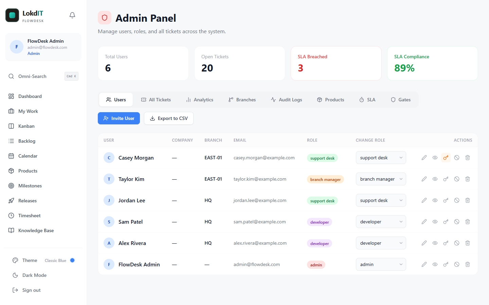

# Getting Started with FlowDesk

This guide is for the **first administrator** of a new FlowDesk installation. It picks up where the setup guide ends: the database is built, the `admin-actions` Edge Function is deployed, and the app is running on Vercel or on your own machine.

If FlowDesk is not running yet, follow [SETUP.md](SETUP.md) first (and [DEPLOY_VERCEL.md](DEPLOY_VERCEL.md) to host it on Vercel).

**Contents**

1. [Sign in for the first time](#1-sign-in-for-the-first-time)
2. [A tour of the layout](#2-a-tour-of-the-layout)
3. [Set up your workspace](#3-set-up-your-workspace)
4. [Invite your team](#4-invite-your-team)
5. [Roles and permissions](#5-roles-and-permissions)
6. [Your first ticket, start to finish](#6-your-first-ticket-start-to-finish)
7. [Your first 15 minutes: checklist](#7-your-first-15-minutes-checklist)
8. [Troubleshooting](#8-troubleshooting)

Related guides: [User Guide](USER_GUIDE.md) (every feature, for everyday users), [Known Issues](KNOWN_ISSUES.md) (current limitations) and [SECURITY.md](../SECURITY.md) (hardening an internet-facing installation).

> **Use a desktop browser for everything in this guide.** Below 768 px wide, FlowDesk shows a simplified ticket list only, with no sidebar and no Admin Panel. See [Mobile](USER_GUIDE.md#mobile).

---

## 1. Sign in for the first time

The database setup creates exactly one account:

| Email | Password |
|---|---|
| `admin@flowdesk.com` | `Password2026!` |

This password is published with the source code, so FlowDesk makes you replace it before you can do anything else.

1. Open your FlowDesk address. That is your Vercel URL (for example `https://your-project.vercel.app`), or `http://localhost:5173` when you run `npm run dev`.
2. Enter the email and password above and click **Sign in**. The email is not case sensitive.

   

3. The **Set Your Password** screen appears. It covers the whole app and has no close button. Choose a new password that meets every rule in the checklist:
   - At least 8 characters.
   - At least 1 number.
   - At least 1 special character. Only these count: `! @ # $ % ^ & * ( ) , . ? " : { } | < >`. A hyphen, underscore or plus sign does **not** count.
   - Not the default setup password (`Password2026!`).
   - Both fields match.

   

4. Click **Save & Continue**. When the password is saved, a "Password updated successfully! Welcome to FlowDesk." message appears and you land on the **Backlog**, the admin home page.

The same rules are checked on the server, so the reset cannot be skipped from the browser. If you want to stop, click **Sign out** under the form. You will see the screen again at your next sign-in.

> **If you see "The admin-actions Edge Function is not deployed or not reachable"**, the password change could not reach the server. Deploy the function as described in [SETUP.md](SETUP.md), then try again. Nothing was changed.

### Recommended: close public sign-ups

FlowDesk has no sign-up page, but a hosted Supabase project accepts sign-ups through its API unless you turn them off. Accounts created that way start deactivated and cannot see any tickets or team data, but there is no reason to allow them.

In the Supabase dashboard, open **Authentication**, then **Sign In / Providers**, and turn off **Allow new users to sign up**. Creating users from FlowDesk's Admin Panel keeps working, because it uses the admin API.

The full hardening checklist for an internet-facing installation is in [SECURITY.md](../SECURITY.md#deployment-hardening-checklist).

---

## 2. A tour of the layout

After sign-in, admins land on the **Backlog**:


### The sidebar

From top to bottom:

| Area | What it does |
|---|---|
| **FlowDesk logo and bell** | The bell opens your notifications. A red dot means you have unread ones. See [Notifications](USER_GUIDE.md#notifications). |
| **Your profile card** | Shows your name, email and role. Click it to edit your name, phone, company and avatar. Your email and role are read-only. Only admins can change a branch. |
| **Omni-Search** | Opens the command palette. The shortcut is **Ctrl+K** (Windows and Linux) or **Cmd+K** (macOS); the button only shows "Cmd K". |
| **Navigation links** | The pages your role can use. The admin section at the bottom (**Admin Panel**, **Executive**, **Reports**) is visible to admins only. |
| **Timer Running** | Appears while you have a time-tracking timer running, with the elapsed time and a stop button. |
| **Theme** | Pick one of six color themes (Classic Blue, Rose Gold, Lavender, Sage, Peach, Orchid) and switch between Light and Dark. |
| **Dark Mode / Light Mode** | A one-click light/dark switch. The first time, FlowDesk follows your operating system setting. |
| **Sign out** | Ends your session. |

Theme and light/dark choices are saved in your browser, so they apply per browser and per device.

### Where each role lands

| Role | Home page after sign-in |
|---|---|
| Admin | Backlog |
| Developer | My Work |
| Support desk | Backlog, filtered to the Triage Queue |
| Branch manager | Support Portal right after signing in; Dashboard when they open the site root later |

### Ctrl+K, the command palette

Press **Ctrl+K** (or **Cmd+K**) on any page to search tickets by ID, title, customer name, customer email or description, or to jump to the Backlog, Kanban board or Admin Panel. Press **Esc** to close it. See [Command palette](USER_GUIDE.md#command-palette-and-keyboard-shortcuts) for details and a current limitation.

### Notifications

FlowDesk sends in-app notifications only; it sends no email. You are notified when:

- A ticket is assigned to you, or a ticket you watch is reassigned.
- The status of a ticket you watch changes.
- Someone comments on a ticket you watch.
- Someone @mentions you in a comment.

You never get a notification for your own actions.

---

## 3. Set up your workspace

Do these four steps in this order. Each one feeds the next:

1. **Branches** come first, because a branch manager must be assigned to a branch when you invite them.
2. **Products** should exist before tickets, so tickets can be linked to them.
3. **SLA targets** should be right before tickets are created, because each ticket's deadlines are calculated when the ticket is created.
4. **Approval gates** decide which status moves need a sign-off.

Everything here lives in the **Admin Panel** (sidebar, under **Admin**). The Admin Panel has eight tabs: Users, All Tickets, Analytics, Branches, Audit Logs, Products, SLA and Gates.

### 3.1 Branches

A branch is a location, office or customer site that tickets belong to. Branch managers can edit only tickets from their own branch, and their Support Portal lists their branch's requests.

1. Open **Admin Panel > Branches** and click **Add Branch**.
2. Enter a **Branch ID**, a short code such as `HQ` or `EAST-01`. It cannot be changed later.
3. Enter a **Branch Name**, such as `Headquarters`.
4. Click **Create Branch**.

Each row has three actions:

- **Edit** (pencil): rename the branch. The ID stays the same.
- **Deactivate / Activate**: an inactive branch disappears from the branch pickers but keeps its tickets.
- **Delete** (trash): asks for confirmation. Tickets and users on that branch become "no branch" (Global).

### 3.2 Products

Products are what your tickets are about: an app, a service, a hardware line. They appear as colored chips on tickets and power the Product Catalog and the "Ticket Volume by Product" chart.

1. Open **Admin Panel > Products** and click **Add Product**.
2. Enter a **Name** (required), an optional **Description**, and pick a **Theme Color**.
3. Click **Create Product**.

Products are never deleted. **Archive** one (after a confirmation) to stop it being picked for new tickets; **Reactivate** brings it back.

### 3.3 SLA targets

FlowDesk has one SLA policy per priority. The defaults, in hours, are:

| Priority | Response | Resolution |
|---|---|---|
| Critical | 1 | 4 |
| High | 4 | 24 (1 day) |
| Medium | 8 | 72 (3 days) |
| Low | 24 (1 day) | 168 (7 days) |

To change one, open **Admin Panel > SLA**, click the pencil on its row, edit the hours, and click **Save**. The ban/check icon disables or enables a policy. You cannot add or remove rows.

How the deadlines work:

- The **response** clock stops the first time a ticket leaves **Intake / New Request**.
- The **resolution** clock stops when the ticket reaches **Released / Closed**.
- Both deadlines are calculated from the ticket's creation time and priority when the ticket is created, and recalculated if the priority changes.
- Editing a policy does **not** change deadlines on tickets that already exist.
- A breach is recorded at the moment the ticket leaves Intake (response) or reaches Released / Closed (resolution). Until then, the SLA badges on cards and in the ticket panel show the time left, or how long ago the deadline passed.

The help box on the SLA tab says breaches trigger notifications. They do not yet; see [Known Issues](KNOWN_ISSUES.md#sla-breach-notifications-are-not-implemented).

### 3.4 Approval gates

A gate blocks one specific status move until a ticket has an approval. Three gates are created for you:

| From | To | Needs |
|---|---|---|
| Ready for Dev | In Progress | Admin approval |
| Approved / Ready to Release | Released / Closed | Customer approval |
| Awaiting Customer Approval | Ready for Dev | Customer approval |

To add a gate:

1. Open **Admin Panel > Gates** and click **+ Add Gate**.
2. Pick a **From Status** and a **To Status** (they must differ).
3. Tick **Admin Approval**, **Customer Approval**, or both.
4. Click **Create Gate**.

On each row, click **YES/NO** under Admin Required or Customer Required to flip that requirement, and click **Active/Off** to switch the gate on or off without deleting it. The trash icon deletes a gate immediately, with no confirmation.

Things to know:

- Approvals are given on the ticket itself, in the **QA & Approvals** box of the ticket panel. Only admins see the **Approve** button for admin approval, and the database refuses admin approval from anyone else. The **Customer Approval** buttons are shown to everyone who opens the ticket: there is no customer login, so your team records the customer's sign-off.
- Approving the customer side of a ticket that is **Awaiting Customer Approval** moves it to **Ready for Dev** automatically.
- Gates are checked when someone changes the ticket's **Status** dropdown in the ticket panel. **Dragging a card on the Kanban board does not check gates yet**, because of a bug, and neither does the status dropdown on **Admin Panel > All Tickets**. Until that is fixed, treat gates as a guide for your team rather than a lock. See [Known Issues](KNOWN_ISSUES.md#kanban-drags-skip-approval-gates).
- Separately from gates, a ticket cannot be moved to **Released / Closed**, on the board or in the panel, until it has **Acceptance Criteria**.

---

## 4. Invite your team

FlowDesk has no sign-up page. Every account is created by an admin.



### Create a user

1. Open **Admin Panel > Users** and click **Invite User**.
2. Fill in the **Create User** form:
   - **Email Address** (required).
   - **Full Name**. Fill this in: @mentions search by full name.
   - **Company Name** (optional).
   - **Assigned Branch**: "None / Global" or one of your active branches. Branch managers need one.
   - **System Role** (required): support desk, developer, admin or branch manager. See [Roles and permissions](#5-roles-and-permissions).
3. Click **Create User**.
4. The **User Created!** screen shows the email and a **temporary password**.

### How temporary passwords work

- FlowDesk generates a random 10-character temporary password in your browser.
- **It is shown once.** Click **Copy Password** before you click **Done**. If you lose it, set a new one with **Force Password Reset** (below).
- **No email is sent.** Although the button says "Invite", FlowDesk does not email anyone. You pass on the sign-in details yourself.
- **Share it securely.** Use a password manager's sharing feature, or tell the person directly. Avoid sending the password in the same message as the sign-in address and email.
- At their first sign-in the person gets the same **Set Your Password** screen you saw, and must choose their own password before they can continue.

### Manage existing users

Each row in the Users table has a **Change Role** dropdown that saves immediately, plus these action icons:

| Icon | Action |
|---|---|
| Pencil | **Edit** the full name, company, branch and role. Email addresses cannot be changed anywhere in FlowDesk. |
| Eye | **Impersonate**: preview FlowDesk with that user's menus. An orange banner offers **Stop Impersonating**. Only the menus change; all data is still loaded and saved with your admin permissions. |
| Key | **Force Password Reset**: type a temporary password (at least 6 characters) and click **Reset Password**. The user must choose a new password at their next sign-in. While a reset is pending the key is orange; clicking the orange key cancels the pending reset without changing the password. |
| Ban / check | **Deactivate** or **Reactivate**. A deactivated user can still sign in but only sees an "Account Deactivated" screen, and the database gives them no ticket or team data. |
| Trash | **Permanently Delete**, after a confirmation. Their open tickets become unassigned; their comments and history stay and show as "Deleted user". You cannot delete yourself. |

Role changes, activations, deactivations, user deletions and ticket deletions are recorded on the **Audit Logs** tab. Click **Refresh** there if actor names show as IDs.

### Accounts created outside FlowDesk

Always create people with **Invite User**. An account created any other way, such as with **Add user** in the Supabase dashboard, starts as an inactive account with the placeholder role `customer`, so the person sees "Account Deactivated". To fix one, either:

- Use **Invite User** with the same email address. FlowDesk takes over the existing account, sets a new temporary password, the role and the branch you chose, and activates it. This only works for accounts that are not already active; an active user gets "A user with this email already exists".
- Or reactivate the user and pick a role for them on the Users tab. Until they have a real role they see a "No Role Assigned" screen.

### Optional: replace the default admin

The default admin's email address is published with the source code. Once you are comfortable:

1. Invite yourself with your own email and the **admin** role.
2. Sign out, then sign in as your new admin and set your password.
3. On the Users tab, deactivate (or permanently delete) `admin@flowdesk.com`.

---

## 5. Roles and permissions

FlowDesk has four roles you can assign:

- **Admin**: runs the workspace. Everything below, plus the Admin Panel, Executive dashboard and Reports.
- **Developer**: works tickets, releases and the knowledge base.
- **Support desk**: triages incoming tickets, answers requesters, maintains the knowledge base.
- **Branch manager**: follows and raises requests for one branch, mainly through the Support Portal.

The database also contains a fifth role, `customer`. It has no screens yet: a user with that role sees "No Role Assigned". See [Known Issues](KNOWN_ISSUES.md#the-customer-role-has-no-user-interface).

### Pages each role can open

| Page | Admin | Developer | Support desk | Branch manager |
|---|---|---|---|---|
| Dashboard | Yes | Yes | Yes | Yes |
| My Work | Yes | Yes | Yes | No |
| Kanban | Yes | Yes | Yes | View only (cannot drag cards) |
| Backlog | Yes | Yes | Yes | No |
| Calendar | Yes | Yes | Yes | No |
| Support Portal | **No** | No | Yes | Yes |
| Products | Yes | Yes | Yes | Yes |
| Milestones | Yes | Yes | Yes | By address only (not in the sidebar) |
| Releases | Yes | Yes | Yes | By address only (not in the sidebar) |
| Timesheet | Yes (anyone's hours) | Own hours | Own hours | No |
| Knowledge Base | Yes | Yes | Yes | By address only; published articles |
| Admin Panel, Executive, Reports | Yes | No | No | No |

"By address only" means the page opens if the person types the URL, for example `/knowledge-base`, but there is no link to it in their sidebar.

### What each role can do

"UI" means the app hides or shows the control. "Database" means the rule is enforced by row level security, so it holds even if someone calls the API directly.

| Action | Admin | Developer | Support desk | Branch manager | Enforced by |
|---|---|---|---|---|---|
| See all tickets | Yes | Yes | Yes | Yes | Database |
| Create tickets | Yes | Yes | Yes | Yes | Database |
| Edit tickets (status, fields, assignee) | All | All | All | Own branch only | Database |
| Delete tickets | Yes | Yes | Yes | No | Database |
| Set a branch or the "Known Issue" flag on a new ticket | Yes | Yes | No | No | UI |
| Grant **admin** approval | Yes | No | No | No | UI and database |
| Grant or revoke **customer** approval, revoke admin approval | Yes | Yes | Yes | Own branch only | Database |
| Link tickets (blocks, duplicate of, and so on) | Yes | Yes | Yes | No | Database |
| Add or remove watchers | Yes | Yes | Yes | Yes | Database |
| Read internal notes | Yes | Yes | Yes | **No** | Database |
| Post comments | Yes | Yes | Yes | Yes | Database |
| Delete comments | Any | Own | Own | Own | Server (Edge Function) |
| Dev Tasks and Branch Info sections of a ticket | Yes | Yes | Yes | Hidden | UI |
| Log time on a ticket | Yes | Yes | Yes | Yes | Database |
| Edit or delete time entries | Any | Any | Any | Own | Database |
| Create, edit or delete milestones | Yes | Yes | Yes | Yes | Database |
| Create, edit or delete releases | Yes | Yes | No | No | Database |
| Write knowledge base articles and see drafts | Yes | Yes | Yes | No | UI and database |
| Submit a request from the Support Portal | Not available | Not available | No | Yes | UI |
| Manage users, branches, products, SLA targets and gates; read audit logs | Yes | No | No | No | UI and database |

Notes:

- Support desk users see the **New Release** button on the Releases page, but saving fails with a permission error.
- The ticket panel shows a **Delete** button to every role. For a branch manager the database refuses the delete, although the ticket only reappears after a reload ([known issue](KNOWN_ISSUES.md#edits-the-database-refuses-can-look-successful)).
- A deactivated user of any role gets no ticket or team data.

---

## 6. Your first ticket, start to finish

This walk-through uses the default approval gates from [section 3.4](#34-approval-gates). It works best with at least one product and a second user (for example a developer), but neither is required.

### Create the ticket

1. Open the **Backlog** and click **New Ticket**. The **Create New Request** form opens.
2. Fill in:
   - **Title**, for example `Login button does nothing on the settings page`.
   - **Description**: steps to reproduce. The editor supports bold, italic, lists, code blocks and headings (select text to see the formatting menu), and **Attach** for inline images and files.
   - **Acceptance Criteria**, for example `Clicking Login on the settings page opens the login dialog`. A ticket cannot be closed without this.
   - **Type**: Bug. **Priority**: High.
   - Optionally **Customer Name** (for example `Example Co`), **Customer Email** (for example `it@example.com`), **Catalog Product**, **Assign to Branch**, and one **Attachment**.
3. Click **Create Ticket**.

The ticket gets the next number, starting at `FLD-0001`, status **Intake / New Request**, and its SLA deadlines.

### Work the ticket

Click the row to open the ticket panel on the right. Every change saves as you make it; **Save & Close** just closes the panel.


1. **Assigned to**: pick the developer. They get a notification.
2. **Watchers**: hover over "0 watching" and tick yourself. You will now hear about status changes and comments.
3. Scroll to **Scope & Timeline**, click **Edit Timeline**, set a **Due Date**, and click **Save Timeline**. The ticket now appears on the Calendar.
4. In the **Unified Ticket Feed** at the bottom, type a comment. Type `@` and the start of a person's full name to mention them, choose a name with the arrow keys and Enter, then click the arrow button to send.
5. Write a second comment, tick **Internal Whisper Note**, and send it. Internal notes are yellow and hidden from branch managers and from the Support Portal.

### Move it across the Kanban board

Open **Kanban** in the sidebar. The board has six columns: Intake / New Request, Ready for Dev, In Progress, On-Hold, Approved / Ready to Release, and Released / Closed.


1. Drag the card from **Intake / New Request** to **Ready for Dev**. The move is saved and logged in the ticket's feed, and the response SLA clock stops.
2. Click the card to open it. In the **Status** dropdown, choose **In Progress**. The change is refused with the message "Admin approval is required before this transition." That is the first default gate at work.
3. In **QA & Approvals**, click **Approve** next to **Admin Approval**. Now choose **In Progress** in the Status dropdown again, or close the panel and drag the card to **In Progress**. This time the move goes through.
4. Drag the card to **On-Hold**. Pick a reason in "Why is this request on hold?" (Customer, Developer, Support or SOW hold). The card shows a "Hold:" chip. Drag it back to **In Progress** when the hold is over.
5. Drag it to **Approved / Ready to Release**.
6. Open the ticket and click **Approve** next to **Customer Approval**. That satisfies the second default gate (Approved / Ready to Release to Released / Closed).
7. Drag the card to **Released / Closed**. If the ticket had no Acceptance Criteria, the card would snap back with "Cannot move to Done. Acceptance Criteria is required."

> **Record approvals before you drag.** Because of a [known bug](KNOWN_ISSUES.md#kanban-drags-skip-approval-gates), a Kanban drag does not check approval gates yet. Only the Status dropdown in the ticket panel enforces them.

The ticket is now closed. Its resolution time counts towards the Executive dashboard and Reports, and the SLA boxes in the ticket panel show **Met** or **Breached**.

> Five statuses have no Kanban column: Planning, SOW In Progress, Awaiting Customer Approval, In Review and Rejected. A ticket set to one of them (from the ticket panel's **Status** dropdown) disappears from the board but stays in the Backlog and My Work. See [Known Issues](KNOWN_ISSUES.md#five-statuses-have-no-kanban-column).

---

## 7. Your first 15 minutes: checklist

- [ ] Sign in as `admin@flowdesk.com` and replace the default password.
- [ ] In Supabase, turn off **Allow new users to sign up** (Authentication > Sign In / Providers).
- [ ] Click your profile card; add your name and an avatar. Try the **Theme** picker.
- [ ] **Admin Panel > Branches**: add at least one branch, for example `HQ` / `Headquarters`.
- [ ] **Admin Panel > Products**: add one or two products.
- [ ] **Admin Panel > SLA**: check the four targets suit your team.
- [ ] **Admin Panel > Gates**: keep, change or switch off the three default gates.
- [ ] **Admin Panel > Users > Invite User**: create a developer, a support desk user and a branch manager (with a branch). Copy each temporary password before clicking Done.
- [ ] Use the eye icon to preview the branch manager's menus, then **Stop Impersonating**.
- [ ] Create a ticket with Acceptance Criteria, assign it, watch it, and comment with an @mention.
- [ ] Walk it across the Kanban board to **Released / Closed**, recording the admin and customer approvals on the way.
- [ ] Press **Ctrl+K** and search for your ticket's number.
- [ ] Optional: invite a second admin for yourself and deactivate `admin@flowdesk.com`.

Next, share the [User Guide](USER_GUIDE.md) with your team.

---

## 8. Troubleshooting

The most common first-day problems are below. [TROUBLESHOOTING.md](TROUBLESHOOTING.md) covers more, including Edge Function errors, live updates and uploads.

| What you see | Why | What to do |
|---|---|---|
| "FlowDesk isn't configured yet" | `VITE_SUPABASE_URL` or `VITE_SUPABASE_ANON_KEY` is missing or invalid in the build. | Set both, then restart `npm run dev` or redeploy on Vercel. Vercel only applies environment variable changes to new deployments. See [SETUP.md](SETUP.md). |
| A browser alert "Invalid login credentials" | Wrong email or password, or the admin seed was not run. | Check the password. Make sure `supabase/migrations/20260926000100_seed_admin.sql` ran after the schema file. |
| "The admin-actions Edge Function is not deployed or not reachable" | The `admin-actions` function is missing or has another name. | Deploy it with the exact name `admin-actions` ([SETUP.md](SETUP.md)). Password changes, creating users and deleting comments all need it. |
| "Account Deactivated" | The account's `is_active` flag is off, or it was created outside FlowDesk. | An admin reactivates it on the Users tab. |
| "No Role Assigned" | The account has the placeholder `customer` role. | An admin picks a role for it on the Users tab. |
| A Kanban move to Released / Closed snaps back | The ticket has no Acceptance Criteria. | Read the message at the top of the screen, add the criteria in the ticket panel, and try again. |
| A status change in the ticket panel is refused | An approval gate needs admin or customer approval first. | Approve it in **QA & Approvals**, then change the status again. |
| Pages load slowly, then show nothing, or sign-in fails with a network error | Free Supabase projects are paused after about a week without activity. | Restore the project from the Supabase dashboard. |
| You are locked out of every admin account | Forgotten password, or the account was deactivated. | Run the SQL below. |

To recover the default admin, open the **SQL Editor** in the Supabase dashboard and run the following. It resets the password to `Password2026!`, re-enables the account, makes it an admin, and forces a new password at the next sign-in. For another user, change the email and choose your own temporary password.

```sql
UPDATE auth.users
   SET encrypted_password = extensions.crypt('Password2026!', extensions.gen_salt('bf')),
       updated_at = now()
 WHERE email = 'admin@flowdesk.com';

UPDATE public.profiles
   SET role = 'admin', is_active = true, force_password_reset = true
 WHERE email = 'admin@flowdesk.com';
```
