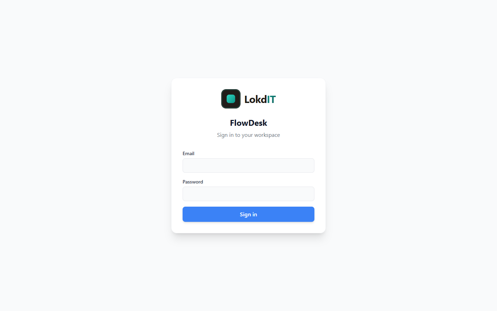
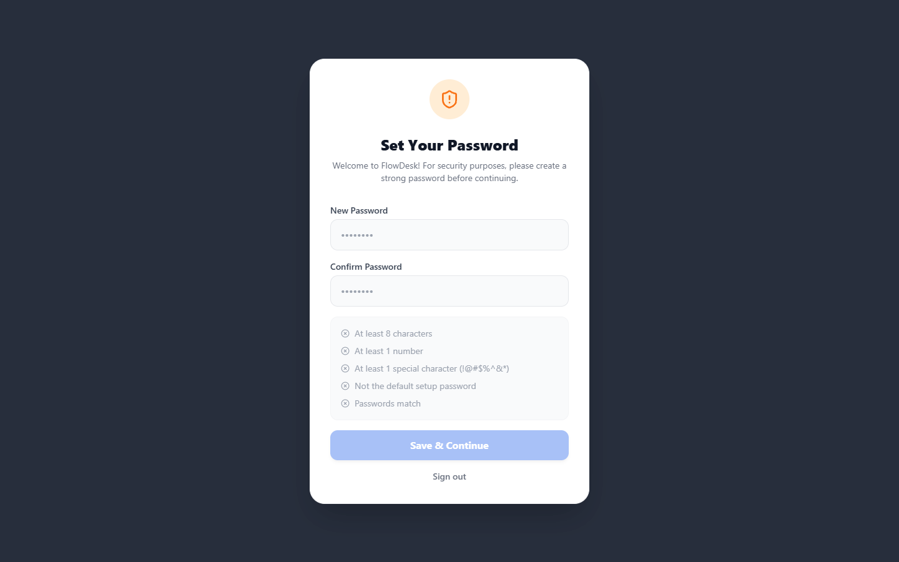

# Setting up FlowDesk

This guide takes you from nothing to a working FlowDesk on a **free Supabase project**, running on your own computer and (optionally) on a **free Vercel account**. No prior Supabase or Vercel experience is needed. Plan for about 30 minutes.

If you only want the short version, the [README](../README.md#quick-start) has a six-step summary that links back here.

**Contents**

- [Prerequisites](#prerequisites)
- [How the pieces fit together](#how-the-pieces-fit-together)
1. [Get the code](#1-get-the-code)
2. [Create a free Supabase project](#2-create-a-free-supabase-project)
3. [Create the database](#3-create-the-database)
4. [Deploy the admin-actions Edge Function](#4-deploy-the-admin-actions-edge-function)
5. [Lock down Authentication](#5-lock-down-authentication)
6. [Copy your Project URL and public key](#6-copy-your-project-url-and-public-key)
7. [Run FlowDesk locally](#7-run-flowdesk-locally)
8. [Sign in for the first time](#8-sign-in-for-the-first-time)
9. [Deploy to Vercel](#9-deploy-to-vercel)
- [Locked out? Reset the admin password](#locked-out-reset-the-admin-password)
- [Optional: run Supabase locally with Docker](#optional-run-supabase-locally-with-docker)
- [Optional: FullCalendar Timeline license key](#optional-fullcalendar-timeline-license-key)

> Dashboards change. The steps below use the names Supabase and Vercel show today. If a button has moved, look for the same words nearby, or check the linked official docs.

---

## Prerequisites

| You need | Why | Notes |
|---|---|---|
| [Node.js](https://nodejs.org/) **20 or newer** | Runs the dev server, the build and the Supabase CLI | The current LTS (22 or 24) is a good choice. Check with `node -v`. |
| [Git](https://git-scm.com/downloads) | Downloads the code | Optional if you use **Download ZIP**. |
| A free [GitHub](https://github.com/signup) account | Vercel deploys from a GitHub repository | Only needed for step 9. |
| A free [Supabase](https://supabase.com/dashboard) account | Database, sign-in, file storage, live updates | The Free plan is enough. |
| A free [Vercel](https://vercel.com/signup) account | Hosts the website | Only needed for step 9. |
| A text editor | To edit `.env.local` | Any editor works, for example VS Code. |

You do **not** need Docker, unless you choose the [optional local Supabase stack](#optional-run-supabase-locally-with-docker).

## How the pieces fit together

```text
 Your browser
   |
   |  FlowDesk (a React single-page app)
   |  served by `npm run dev` on your computer, or by Vercel
   |
   +--> Supabase project
          - Postgres database with Row Level Security (every table)
          - Auth (email + password sign-in)
          - Storage (avatars, ticket attachments)
          - Realtime (live boards, comments, notifications)
          - Edge Function "admin-actions" (creating users, password changes)
```

FlowDesk has no server of its own. Everything the browser is not allowed to do directly, such as creating a user account, runs in the `admin-actions` Edge Function inside your Supabase project.

---

## 1. Get the code

Pick one of these options.

**Option A: clone with Git**

```bash
git clone https://github.com/OWNER/flowdesk.git
cd flowdesk
```

**Option B: fork, then clone (best if you will deploy to Vercel)**

1. Open https://github.com/OWNER/flowdesk and click **Fork**. This makes your own copy of the repository, which Vercel can deploy from.
2. Clone your fork:

   ```bash
   git clone https://github.com/<your-username>/flowdesk.git
   cd flowdesk
   ```

**Option C: download a ZIP**

1. Open https://github.com/OWNER/flowdesk, click **Code**, then **Download ZIP**.
2. Extract it and open a terminal in the extracted folder.

   To deploy to Vercel later, you will need to put the code in a GitHub repository of your own. Forking (option B) is the easiest way.

You need the code even if you do everything else in the browser: steps 3 and 4 use files from it.

| File | Used in |
|---|---|
| `supabase/migrations/20260926000000_flowdesk_schema.sql` | Step 3 (database schema) |
| `supabase/migrations/20260926000100_seed_admin.sql` | Step 3 (default admin account) |
| `supabase/functions/admin-actions/index.ts` | Step 4 (Edge Function) |
| `.env.example` | Step 7 (your settings) |

---

## 2. Create a free Supabase project

1. Go to https://supabase.com/dashboard and sign up or sign in (GitHub or email).
2. If you are asked to create an organization, give it any name and choose the **Free** plan.
3. Create a new project (the **New project** button, or go to https://database.new).
4. Fill in the form:

   | Field | What to enter |
   |---|---|
   | **Project name** | Anything, for example `flowdesk`. |
   | **Database password** | Click **Generate a password**, or type a strong one. **Save it in your password manager now.** The command-line route in step 3 (option B) asks for it, and it is not shown again. |
   | **Region** | The region closest to your users. It cannot be changed later. |
   | Security / Data API options, if shown | Keep the defaults. FlowDesk talks to the database through the **Data API**, so it must stay enabled, using the `public` schema. |

5. Click **Create new project** and wait a minute or two until the project is ready.

> **Free plan limits worth knowing:** two active free projects per account, a 500 MB database, a 50 MB maximum file size, and **free projects are paused after about a week without activity**. A paused project makes FlowDesk look broken until you open the Supabase dashboard and click **Resume project**. See [Supabase: project pausing](https://supabase.com/docs/guides/platform/free-project-pausing).

---

## 3. Create the database

FlowDesk's whole database is defined in two SQL files. Run them **in this order**:

| Order | File | What it does |
|---|---|---|
| 1 | `supabase/migrations/20260926000000_flowdesk_schema.sql` | Creates everything FlowDesk needs: the types, 18 tables, indexes, functions and triggers, **Row Level Security** policies on every table, the two storage buckets (`avatars`, 5 MB images; `ticket_attachments`, 50 MB any file type), the **Realtime** setup for live updates, and default settings: four SLA targets and three approval gates. It creates **no** users, branches, products or tickets. |
| 2 | `supabase/migrations/20260926000100_seed_admin.sql` | Creates the one account you need to get started: **`admin@flowdesk.com`** with password **`Password2026!`**, role `admin`, flagged so that FlowDesk forces a password change at the first sign-in. |

Both files are **safe to run more than once**. Tables are only created when missing and no data is deleted. If the admin already exists, the seed leaves it unchanged.

Choose option A (browser only) or option B (command line).

### Option A: Supabase SQL Editor (no install)

1. In your Supabase project, open **SQL Editor** in the left sidebar and start a new query (the **+** or **New query** button).
2. Open `supabase/migrations/20260926000000_flowdesk_schema.sql` in your text editor, select everything and copy it. (On GitHub, open the file and use the **Copy raw file** button.)
3. Paste it into the SQL Editor. **Make sure no text is highlighted**, then click **Run** (or press Ctrl+Enter / Cmd+Enter).
   - The file is long (about 1,900 lines). It finishes in a few seconds.
   - If the editor warns that the query contains destructive operations, confirm and run it. The file drops and re-creates its **own** triggers and policies so it can be re-run; it does not delete your data.
   - You should see **Success. No rows returned**.
4. Start another new query, paste the whole of `supabase/migrations/20260926000100_seed_admin.sql`, and click **Run**. Again you should see a success message.
5. Optional check. Run this query:

   ```sql
   select email, role, is_active, force_password_reset from public.profiles;
   ```

   You should get one row: `admin@flowdesk.com`, `admin`, `true`, `true`.

If you get an error, see [SQL errors when running the scripts](TROUBLESHOOTING.md#sql-errors-when-running-or-re-running-the-scripts).

### Option B: Supabase CLI

The [Supabase CLI](https://supabase.com/docs/guides/local-development/cli/getting-started) runs through `npx`, so there is nothing to install globally. The first time, `npx` asks to download the `supabase` package: answer `y`. Docker is **not** needed for these commands.

1. Find your **project ref**: it is the random-looking part of your project's address, `https://<project-ref>.supabase.co`, and of the dashboard URL `https://supabase.com/dashboard/project/<project-ref>`. It is also shown as the Project ID under **Project Settings > General**.
2. From the repository folder, run:

   ```bash
   npx supabase login
   npx supabase link --project-ref <project-ref>
   npx supabase db push
   ```

   - `login` opens your browser to authorize the CLI.
   - `link` asks for the **database password** from step 2. It writes `supabase/.temp/`, which is git-ignored.
   - `db push` shows the two migration files and asks for confirmation, then applies them in order. The CLI remembers which files it applied, so later pushes only apply new ones.

---

## 4. Deploy the admin-actions Edge Function

**This step is required.** Without it, nobody can finish their first sign-in, including the default admin.

### Why FlowDesk needs it

The browser only ever holds the **public** key, which can do only what Row Level Security allows. A few actions need full (secret-key) access, so they run server-side in the `admin-actions` Edge Function. The function checks who is calling and whether they are allowed before it does anything.

| What you do in FlowDesk | Function action | Who may do it |
|---|---|---|
| Choose a new password on the **Set Your Password** screen (every new user's first sign-in, including the default admin) | `update-password` | The signed-in user, for their own account only |
| **Admin > Users > Invite User** | `create-user` | Admins |
| **Admin > Users > Force Password Reset** (key icon) | `admin-force-password-reset` | Admins |
| Delete a comment on a ticket | `delete-comment` | Admins, or the comment's author |

**There are no secrets to set.** Supabase automatically gives every Edge Function your project URL and secret key (`SUPABASE_URL`, and `SUPABASE_SECRET_KEYS` or the legacy `SUPABASE_SERVICE_ROLE_KEY`). The secret key never leaves Supabase.

**JWT verification must be off for this function.** The function verifies the caller's sign-in token itself before every action. Supabase's built-in "verify JWT" gateway check is a legacy feature (the dashboard labels it "with legacy secret"); on projects that use the newer signing keys it can reject valid users before the function even runs. Supabase itself now recommends turning that check off and verifying in code, which is what `admin-actions` does.

The function must be named exactly **`admin-actions`**. The app calls it by that name.

### Option A: Supabase dashboard (no install)

1. In your project, open **Edge Functions** in the left sidebar.
2. Click **Deploy a new function** and choose **Via Editor**.
3. Delete all the template code in the editor. Open `supabase/functions/admin-actions/index.ts` from the repository, copy **all** of it, and paste it into the editor.
4. Set the function name to exactly **`admin-actions`** (all lowercase, with a hyphen). The name box is next to the deploy button; the editor may suggest a random name, so replace it.
   The name becomes part of the function's web address and **cannot be changed later**. If you get it wrong, deploy a new function with the right name and delete the wrong one.
5. Click **Deploy function** and wait for the success message.
6. Open the new function and go to its **Details** tab. Under **Function configuration**, turn **off** the JWT setting (currently labelled **Verify JWT with legacy secret**) and click **Save changes**.

If you edit or redeploy the function from the dashboard later, check this setting again afterwards.

### Option B: Supabase CLI

From the repository folder:

```bash
npx supabase login
npx supabase functions deploy admin-actions --project-ref <project-ref> --no-verify-jwt
```

If you already ran `npx supabase link` in step 3, you can leave out `--project-ref <project-ref>`. Docker is not required. `supabase/config.toml` also sets `verify_jwt = false` for this function; the `--no-verify-jwt` flag makes it explicit.

### Check that it works

Open this address in your browser, with your own project ref:

```text
https://<project-ref>.supabase.co/functions/v1/admin-actions
```

| You see | Meaning |
|---|---|
| `{"error":"Method not allowed"}` | Deployed correctly, JWT verification off. |
| A 401 message such as `Missing authorization header` | Deployed, but JWT verification is still **on**. Turn it off (option A, step 6) or redeploy with `--no-verify-jwt`. |
| A "not found" error | Not deployed, or deployed under another name. |

---

## 5. Lock down Authentication

### Turn off public sign-ups

FlowDesk has no sign-up page: an admin creates every account in **Admin > Users > Invite User**. But your Supabase project's sign-up API is public, and the key it needs ships inside every copy of the app. Unless you switch sign-ups off, anyone could create an account through the API. Such accounts start deactivated, with a placeholder role, and cannot see any data, but there is no reason to allow them.

1. In Supabase, open **Authentication**, then **Sign In / Providers**.
2. Turn **off** **Allow new users to sign up**, then save.

Creating users from FlowDesk keeps working, because the Edge Function uses the admin API, which is not affected by this setting.

### Set the Site URL and Redirect URLs

1. Open **Authentication**, then **URL Configuration**.
2. Set **Site URL**:
   - to `http://localhost:5173` while you only run FlowDesk on your computer, and
   - to your Vercel address (for example `https://your-project.vercel.app`, or your custom domain) once you have deployed it (step 9).
3. Under **Redirect URLs**, add:

   ```text
   http://localhost:5173/**
   https://your-project.vercel.app/**
   ```

   Replace `your-project.vercel.app` with your real Vercel address once you have one. If you also want Vercel preview deployments covered, add `https://*-<team-or-account-slug>.vercel.app/**` (the pattern Supabase documents for Vercel previews).

**Why:** FlowDesk signs in with email and password only and sends no emails of its own (no sign-up, magic-link or reset emails), so these settings are not used in everyday use. They are housekeeping: Supabase uses the Site URL for any auth link it generates, and the default, `http://localhost:3000`, points nowhere. Keeping both lists accurate means any such link lands on your FlowDesk. See [Supabase: redirect URLs](https://supabase.com/docs/guides/auth/redirect-urls).

Leave the other Authentication settings at their defaults.

---

## 6. Copy your Project URL and public key

FlowDesk needs two values from Supabase:

| Value | Where to find it | Looks like |
|---|---|---|
| **Project URL** | Click **Connect** at the top of your project dashboard. You can also build it from your project ref (step 3, option B). | `https://abcdefghijklmnopqrst.supabase.co` |
| **Publishable key** (recommended) | **Connect** dialog, or **Project Settings > API Keys**, on the publishable key section. | `sb_publishable_...` |
| or the legacy **anon** key | **Project Settings > API Keys**, on the **Legacy API Keys** tab, the `anon` `public` key. | A long string starting with `eyJ` |

Either key works. Supabase is phasing out the legacy keys, so prefer the publishable key. The setting is called `VITE_SUPABASE_ANON_KEY` for historical reasons; it accepts both kinds. (If you copy a ready-made line from the **Connect** dialog named `VITE_SUPABASE_PUBLISHABLE_KEY`, FlowDesk accepts that name too.)

> [!WARNING]
> **Never use the secret key (`sb_secret_...`) or the legacy `service_role` key in FlowDesk's settings.** Everything in `VITE_...` variables is compiled into the JavaScript that every visitor downloads. A secret key there would give anyone full access to your database, bypassing every security rule. FlowDesk never needs it in the browser: the Edge Function already has it on the server.

---

## 7. Run FlowDesk locally

1. Install the dependencies (from the repository folder):

   ```bash
   npm install
   ```

2. Create your settings file from the example.

   macOS / Linux:

   ```bash
   cp .env.example .env.local
   ```

   Windows (Command Prompt or PowerShell):

   ```bash
   copy .env.example .env.local
   ```

3. Open `.env.local` and fill in the two values from step 6:

   ```bash
   VITE_SUPABASE_URL=https://abcdefghijklmnopqrst.supabase.co
   VITE_SUPABASE_ANON_KEY=sb_publishable_your_key_here
   # Optional, see "FullCalendar Timeline license key" below
   VITE_FULLCALENDAR_LICENSE_KEY=
   ```

   No quotes and no spaces around `=`. `.env.local` is git-ignored, so it is never committed.
   On Windows, make sure the file is really called `.env.local` and not `.env.local.txt` (in Notepad, choose **Save as type: All files**).

4. Start the development server:

   ```bash
   npm run dev
   ```

5. Open **http://localhost:5173**.

You should see the FlowDesk sign-in page. If you see **"FlowDesk isn't configured yet"** instead, the app could not find one or both values: the screen shows which one is missing. Fix `.env.local`, then stop the dev server (Ctrl+C) and run `npm run dev` again. Vite only reads `.env.local` when it starts. See [Troubleshooting](TROUBLESHOOTING.md#flowdesk-isnt-configured-yet).

Other useful commands:

| Command | What it does |
|---|---|
| `npm run build` | Type-checks and builds the production site into `dist/` (the same command Vercel runs). |
| `npm run preview` | Serves the built `dist/` folder locally (http://localhost:4173). |
| `npm run lint` | Runs ESLint. |

---

## 8. Sign in for the first time

1. On the sign-in page, enter:

   | Email | Password |
   |---|---|
   | `Admin@flowdesk.com` | `Password2026!` |

   The email is not case sensitive (it is stored as `admin@flowdesk.com`).

   

2. The **Set Your Password** screen appears and covers the whole app. This happens because the default password is published with the source code. Choose a new password that:
   - has at least 8 characters,
   - contains at least 1 number,
   - contains at least 1 special character from `! @ # $ % ^ & * ( ) , . ? " : { } | < >` (a hyphen, underscore or plus sign does not count),
   - is not `Password2026!`.

   

3. Click **Save & Continue**. You land on the **Backlog**, the admin's home page.

If the screen shows **"The admin-actions Edge Function is not deployed or not reachable"**, go back to [step 4](#4-deploy-the-admin-actions-edge-function). Nothing was changed; try again once the function is deployed.

**Next:** follow [GETTING_STARTED.md](GETTING_STARTED.md) to set up branches and products, invite your team, and work your first ticket.

> [!IMPORTANT]
> Before you put FlowDesk on the internet, make sure the default password has been changed (the first sign-in forces this), and consider replacing the default admin with an account under your own email address. See [Replace the default admin](GETTING_STARTED.md#optional-replace-the-default-admin).

---

## 9. Deploy to Vercel

When FlowDesk works locally, put it online with a free Vercel account. Follow **[DEPLOY_VERCEL.md](DEPLOY_VERCEL.md)**. In short:

1. Import your GitHub repository into Vercel (framework preset **Vite**).
2. Add `VITE_SUPABASE_URL` and `VITE_SUPABASE_ANON_KEY` as environment variables.
3. Deploy.
4. Add your Vercel address to Supabase **Authentication > URL Configuration** (step 5).

The Vercel site uses the same Supabase project, database and Edge Function you set up here. There is nothing extra to deploy on the Supabase side.

---

## Locked out? Reset the admin password

If you forget the admin password, or every admin account gets deactivated, open the **SQL Editor** in the Supabase dashboard and run the following. It resets the default admin's password to `Password2026!`, re-enables the account, makes it an admin again, and forces a new password at the next sign-in.

```sql
UPDATE auth.users
   SET encrypted_password = extensions.crypt('Password2026!', extensions.gen_salt('bf')),
       updated_at = now()
 WHERE email = 'admin@flowdesk.com';

UPDATE public.profiles
   SET role = 'admin', is_active = true, force_password_reset = true
 WHERE email = 'admin@flowdesk.com';
```

The same two statements work for any other user: change the email, and use a temporary password of your own instead of `Password2026!`. Because the account is flagged for a reset, the Edge Function from [step 4](#4-deploy-the-admin-actions-edge-function) must be deployed for the next sign-in to succeed.

---

## Optional: run Supabase locally with Docker

For contributors who change the SQL or the Edge Function, or want a disposable database. Everyone else can skip this and use the free hosted project.

**Needs:** Node.js 20+, and [Docker Desktop](https://docs.docker.com/desktop/) (or another Docker-compatible runtime) running.

1. Start the local stack. The first run downloads the Docker images and takes a few minutes. Every file in `supabase/migrations/` is applied in order, so the local database already contains the default admin. The local stack also serves the `admin-actions` Edge Function.

   ```bash
   npx supabase start
   ```

2. Show the local addresses and keys at any time:

   ```bash
   npx supabase status
   ```

3. Point FlowDesk at the local stack in `.env.local`, using the **Project URL** and the **Publishable** key from the status output:

   ```bash
   VITE_SUPABASE_URL=http://127.0.0.1:54321
   VITE_SUPABASE_ANON_KEY=<publishable key from "npx supabase status">
   ```

4. Run `npm run dev` and sign in as `admin@flowdesk.com` / `Password2026!`.

Useful commands:

| Command | What it does |
|---|---|
| `npx supabase db reset` | Deletes the local database and re-applies every migration. **Local data is lost.** |
| `npx supabase functions serve admin-actions` | Serves the function with live reload and prints its logs in the terminal. Handy while editing `index.ts`. |
| `npx supabase stop` | Stops the stack. Data is kept for the next `start`. |

The local stack reads `supabase/config.toml`: API on `http://127.0.0.1:54321`, the local dashboard (Studio) on `http://127.0.0.1:54323`, sign-ups disabled, and `verify_jwt = false` for `admin-actions`. The hosted project ignores this file (except that `supabase functions deploy` reads the function settings). More detail for developers is in [ARCHITECTURE.md](ARCHITECTURE.md#10-local-development-with-the-supabase-cli).

---

## Optional: FullCalendar Timeline license key

The **Calendar** page has two views. The month/week **Calendar** view uses free FullCalendar plugins. The **Timeline** view (one swimlane per assignee) uses FullCalendar's premium resource-timeline plugin, which is licensed separately from FlowDesk.

- **Without a key**, everything works, and FullCalendar shows a small license notice on the Timeline view only.
- **With a key**, set it in `.env.local` (and in Vercel, see [DEPLOY_VERCEL.md](DEPLOY_VERCEL.md#4-add-the-environment-variables)), then restart `npm run dev` or redeploy:

  ```bash
  VITE_FULLCALENDAR_LICENSE_KEY=your-fullcalendar-license-key
  ```

FlowDesk's MIT license does not cover FullCalendar Premium. Read [FullCalendar's license page](https://fullcalendar.io/license) to see which option fits your use.

---

Stuck? See [TROUBLESHOOTING.md](TROUBLESHOOTING.md).
