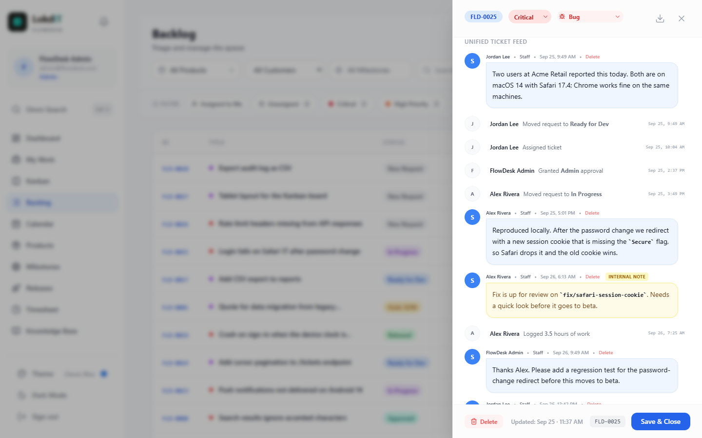
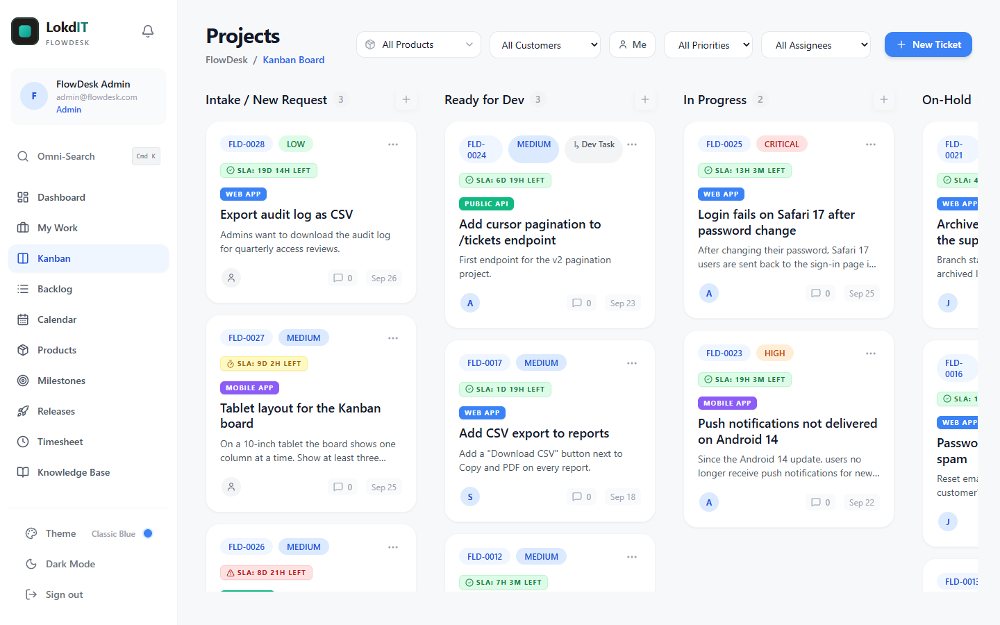
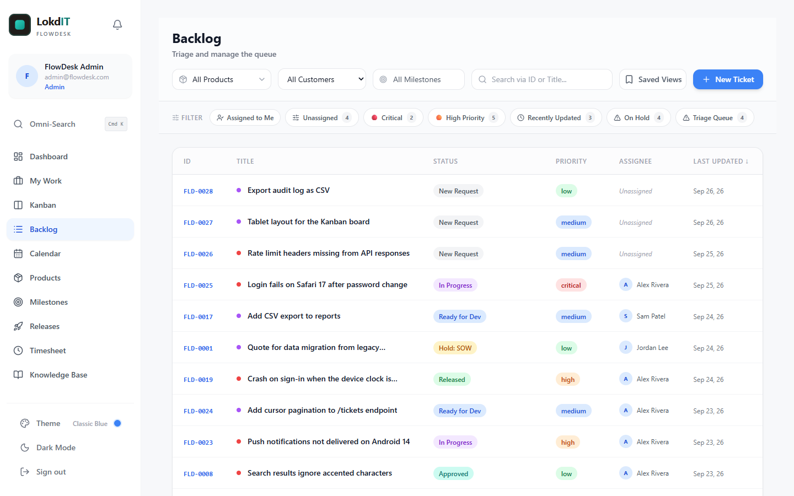
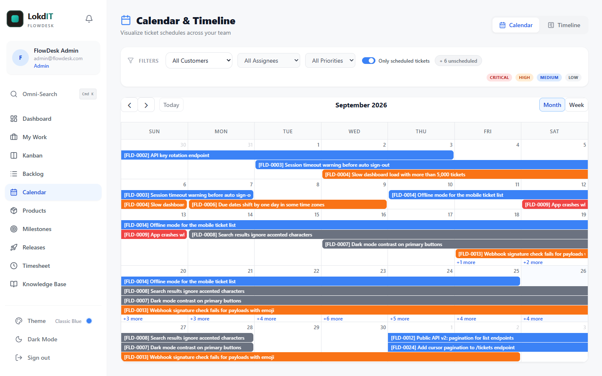
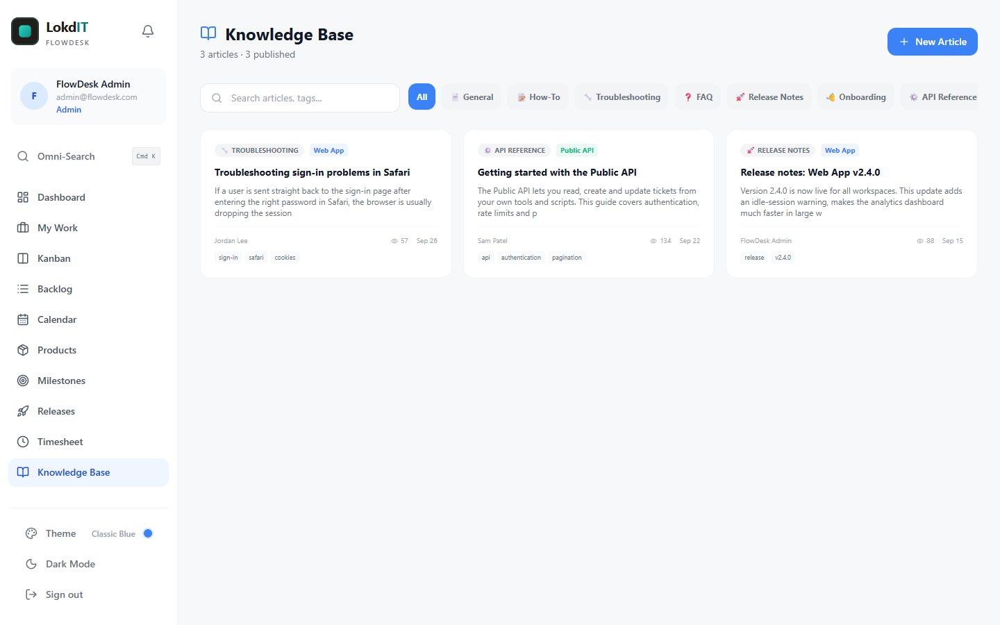
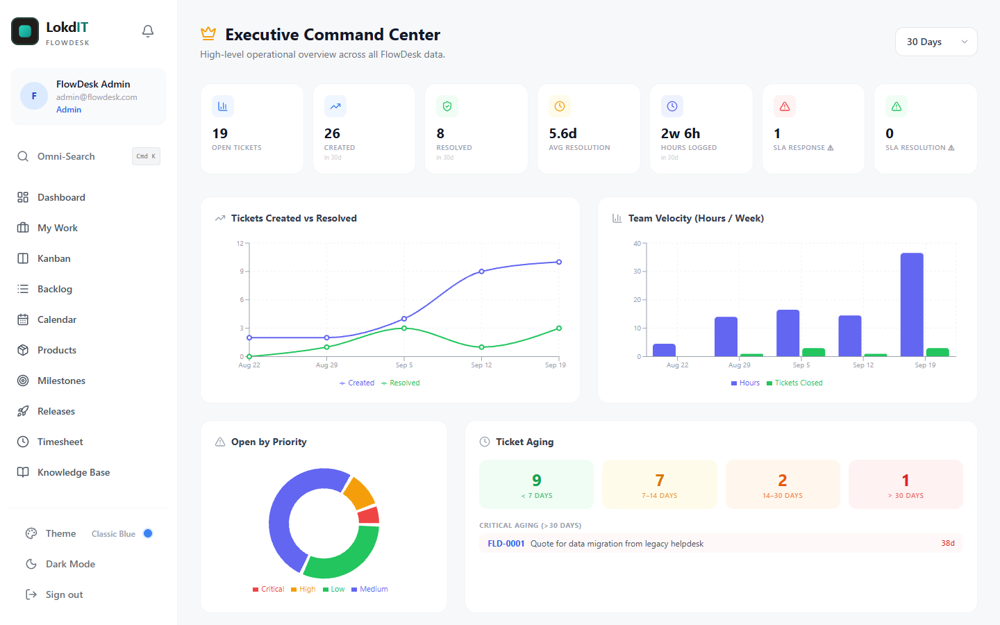

# FlowDesk User Guide

A feature-by-feature reference for everyone who uses FlowDesk day to day: developers, support desk staff, branch managers and admins.

New administrators should start with [GETTING_STARTED.md](GETTING_STARTED.md), which covers first sign-in, workspace setup, inviting users and the full roles table. Current limitations are listed in [KNOWN_ISSUES.md](KNOWN_ISSUES.md).

**Contents**

- [Signing in and your profile](#signing-in-and-your-profile)
- [Tickets](#tickets)
  - [Types and priorities](#types-and-priorities)
  - [Statuses and the workflow](#statuses-and-the-workflow)
  - [Creating a ticket](#creating-a-ticket)
  - [The ticket panel](#the-ticket-panel)
  - [Approvals](#approvals)
  - [Blockers and linked tickets](#blockers-and-linked-tickets)
  - [Parent tickets and dev tasks](#parent-tickets-and-dev-tasks)
  - [Watchers](#watchers)
  - [Comments, internal notes and @mentions](#comments-internal-notes-and-mentions)
  - [Attachments](#attachments)
  - [Activity log](#activity-log)
  - [SLA badges](#sla-badges)
  - [PDF export](#pdf-export)
  - [Deleting a ticket](#deleting-a-ticket)
- [Kanban board](#kanban-board)
- [Backlog](#backlog)
- [My Work](#my-work)
- [Dashboard](#dashboard)
- [Calendar and Timeline](#calendar-and-timeline)
- [Milestones](#milestones)
- [Releases](#releases)
- [Product Catalog](#product-catalog)
- [Time tracking and the Timesheet](#time-tracking-and-the-timesheet)
- [Knowledge Base](#knowledge-base)
- [Reports (admins)](#reports-admins)
- [Executive dashboard (admins)](#executive-dashboard-admins)
- [Support Portal (branch managers and support desk)](#support-portal-branch-managers-and-support-desk)
- [Notifications](#notifications)
- [Command palette and keyboard shortcuts](#command-palette-and-keyboard-shortcuts)
- [Themes and dark mode](#themes-and-dark-mode)
- [Mobile](#mobile)

---

## Signing in and your profile

Your admin creates your account and gives you a temporary password; FlowDesk does not send invitation emails. At your first sign-in you must choose your own password on the **Set Your Password** screen (at least 8 characters, a number, and a special character such as `!`, `@`, `#` or `?`).

There is no "forgot password" link. If you forget your password, ask an admin to use **Force Password Reset**; you will get a new temporary password and choose your own again at the next sign-in.

Click your **profile card** at the top of the sidebar to edit:

- Your avatar (upload an image).
- Full Name. Keep it filled in: other people find you for @mentions by typing the start of your full name.
- Phone Number and Company Name.

Your email address, role and branch are shown but can only be changed by an admin.

Where you land after signing in depends on your role: admins on the Backlog, developers on My Work, support desk on the Backlog's Triage Queue, and branch managers on the Support Portal.

---

## Tickets

Every ticket gets a readable ID such as `FLD-0042`, assigned by the database in order. You can search for a ticket by this ID almost everywhere.

### Types and priorities

| Type | Typical use |
|---|---|
| Bug | Something is broken. |
| Feature Request | Something new is wanted. The default for requests from the Support Portal. |
| Improvement | An existing feature should work better. |
| Task | A unit of work under a parent ticket (a "dev task"). A task must have a parent. |
| Documentation | Docs to write or fix. |
| Professional Service | Billable service work. Shown as "Service" in the ticket panel. |
| Project | A larger piece of work, usually with dev tasks under it. |

Priorities are **Low**, **Medium**, **High** and **Critical**. The priority sets the ticket's SLA deadlines (see [SLA badges](#sla-badges)). Changing the priority recalculates them.

### Statuses and the workflow

The normal path is left to right on the Kanban board: **Intake / New Request > Ready for Dev > In Progress > Approved / Ready to Release > Released / Closed**. The full list, in the order the ticket panel shows it:

| Status (ticket panel) | Kanban column | Progress bar | Meaning |
|---|---|---|---|
| Intake / New Request | Intake / New Request | Intake | New, not yet reviewed. Every new ticket starts here. |
| Planning | *none* | Intake | Being scoped. |
| SOW In Progress | *none* | Intake | A statement of work is being prepared. |
| Awaiting Customer Approval | *none* | Intake | Waiting for the customer to accept the plan or quote. |
| Ready for Dev | Ready for Dev | Ready | Approved and ready to be picked up. |
| In Progress | In Progress | In Progress | Being worked on. |
| In Review | *none* | In Progress | Work done, under review. |
| On-Hold: Customer, Dev, Support or SOW | On-Hold | "Ticket is On Hold" | Paused; the suffix says who or what it waits for. |
| Approved / Ready to Release | Approved / Ready to Release | Approved | Accepted and waiting to ship. |
| Released / Closed | Released / Closed | Released | Finished. |
| Rejected | *none* | "Ticket Rejected" | Will not be done. |

Tickets in a status with no Kanban column are not shown on the board, but they appear in the Backlog, My Work and everywhere else. See [Known Issues](KNOWN_ISSUES.md#five-statuses-have-no-kanban-column).

Some screens use shorter names for the same statuses:

| Status | Backlog | My Work | Support Portal | Mobile | Admin > All Tickets |
|---|---|---|---|---|---|
| Intake / New Request | New Request | New | Pending | NEW REQUEST | Pending |
| Ready for Dev | Ready for Dev | Ready | Ready for Dev | TO DO | Ready for Dev |
| Approved / Ready to Release | Approved | Approved | Beta Testing | UAT | Beta Testing |
| Released / Closed | Released | Released | Resolved | DONE | Done |

**On-hold states.** When you drag a card into the On-Hold column, FlowDesk asks "Why is this request on hold?":

| Choice | Status | Use when |
|---|---|---|
| Customer hold | On-Hold: Customer | Waiting on information or approval from the customer. |
| Developer hold | On-Hold: Dev | Blocked by technical limits, environment issues or dependencies. |
| Support hold | On-Hold: Support | Waiting for an external vendor or an internal support answer. |
| SOW hold | On-Hold: SOW | Waiting for a statement of work to be written or signed. |

Closing the dialog cancels the move. Support-held tickets also appear in the Backlog's **Triage Queue**.

**Two rules apply to status changes:**

- A ticket cannot reach **Released / Closed** without **Acceptance Criteria**.
- Your admin can set up **approval gates**: specific moves that need an admin or customer approval first. See [Approvals](#approvals).

### Creating a ticket

Click **New Ticket** on the Backlog or the Kanban board. The **Create New Request** form has:

| Field | Notes |
|---|---|
| Title | Required. |
| Description | Rich text. See [Comments](#comments-internal-notes-and-mentions) for the editor. |
| Acceptance Criteria | Rich text. What must be true for the ticket to be done. Required before the ticket can be closed, so it pays to add it now. |
| Attachment | Optional, one file: `.csv`, `.pdf`, `.xlsx`, `.xls`, `.png`, `.jpg` or `.jpeg`. Click or drag a file onto the box. It appears in the ticket's Attachments list. |
| Type | Defaults to Bug. |
| Priority | Defaults to Medium. |
| Customer Name and Customer Email | Optional. Suggestions come from tickets you have already loaded. |
| Catalog Product | Active products only. |
| Release Version / Tag | Free text, for example `v2.1.0`. Not linked to the Releases page. |
| Product Family and Product Tier | Free text, for example `Software` / `Pro`. |
| Assign to Branch | Admins and developers only. |
| Flag as Globally Known Bug/Outage | Admins and developers only. Lists the ticket under "Known Outages" in the Product Catalog. |
| Parent Ticket | Shown and required when Type is Task. Lists top-level tickets. |

Click **Create Ticket**. New tickets always start in **Intake / New Request**.

Branch managers usually raise requests from the [Support Portal](#support-portal-branch-managers-and-support-desk) instead: a request made there is automatically tied to their branch.

### The ticket panel

Click a ticket almost anywhere (Backlog row, Kanban card, calendar event, dashboard list) to open the ticket panel on the right.

**Changes save as you make them.** The **Save & Close** button at the bottom only closes the panel. Click outside the panel to close it too.

From top to bottom:

| Section | What you can do |
|---|---|
| Header | The ticket ID; avatars of other people who have the ticket open ("Also viewing:"); **Priority** and **Type** dropdowns; the download icon for [PDF export](#pdf-export). |
| Title | Click the title to edit it, then **Save**. A **BLOCKED** banner appears above it when the ticket is blocked. "Part of Project" shows the parent of a dev task. |
| Project Progress | Parent tickets only: the share of dev tasks that are Released / Closed. |
| Ticket Progress | Where the ticket is on the Intake > Ready > In Progress > Approved > Released path. |
| SLA Status | Response and Resolution boxes with their deadlines. See [SLA badges](#sla-badges). |
| Details | **Created** date; **Assigned to** (admin, developer and support desk users); **Watchers**; **Branch**; **Branch Info** (branch status, its manager, open tickets and recent tickets; hidden from branch managers); **Catalog Product**; **Release Version / Tag** (saved when you leave the field); **Milestone** (open and in-progress milestones); customer name and email. |
| QA & Approvals | Admin and customer approval, gate requirements, and the Known Issue flag. See [Approvals](#approvals). |
| Mark as Blocked | See [Blockers](#blockers-and-linked-tickets). |
| Linked Tickets | See [Linked tickets](#blockers-and-linked-tickets). |
| Status | The full status list. |
| Description and Acceptance Criteria | Click the text (or **Edit**) to open the editor, then **Save** or **Cancel**. |
| Dev Tasks | Child tickets. Hidden from branch managers. See [Parent tickets](#parent-tickets-and-dev-tasks). |
| Attachments | See [Attachments](#attachments). |
| Scope & Timeline | Estimates, dates, the timer and time logs. See [Time tracking](#time-tracking-and-the-timesheet). |
| Unified Ticket Feed | Comments, internal notes and the activity log, oldest first, with the comment box at the bottom. |
| Footer | **Delete**, the last-updated time, and **Save & Close**. |

**Scope & Timeline** fields (click **Edit Timeline**, then **Save Timeline**):

- **Estimated Hours** and **Billed Hours** accept plain numbers (`2.5`) or Jira-style durations: `1w 2d 4h`, where 1w = 40 hours and 1d = 8 hours.
- **Target Start**, **Target Test** and **Due Date**. Tickets with a start or due date appear on the [Calendar](#calendar-and-timeline). A due date in the past makes an open ticket count as **Overdue** on the Dashboard.
- A budget bar compares billed hours with the estimate ("45% budget used" or "Overrun by 4h"). On a parent ticket, estimates and billed hours include its dev tasks.

### Approvals

The **QA & Approvals** box records two independent sign-offs:

- **Admin Approval**: only admins see **Approve**. Anyone who can edit the ticket can **Revoke** it.
- **Customer Approval**: there is no customer login, so the team records the customer's decision here with **Approve** and **Revoke**.

Each approval or revocation is written to the ticket's activity log.

When the ticket's current status has active gates, a **Gate Requirements** box lists each gated next status and whether it is **Ready** or still "Needs Admin approval" / "Needs Customer approval". Your admin manages gates in **Admin Panel > Gates**. The default gates are:

- Ready for Dev to In Progress needs admin approval.
- Approved / Ready to Release to Released / Closed needs customer approval.
- Awaiting Customer Approval to Ready for Dev needs customer approval.

Approving the customer side of a ticket that is **Awaiting Customer Approval** moves it to **Ready for Dev** on its own.

Gates are enforced when you change the **Status** dropdown in the ticket panel. **Dragging a card on the Kanban board does not check gates yet** because of a bug, so record approvals before you drag. See [Known Issues](KNOWN_ISSUES.md#kanban-drags-skip-approval-gates).

Admins and developers also see **Flag as Global Known Issue/Outage** here, which lists the ticket under "Known Outages & High-Priority Bugs" in the [Product Catalog](#product-catalog).

### Blockers and linked tickets

**Mark as Blocked** flags a ticket that cannot move forward:

1. Tick **Mark as Blocked**.
2. Type the reason in "Why is it blocked?". It is saved when you click outside the field.
3. Optionally pick the ticket it is waiting on from the dropdown. The panel then shows "Waiting on FLD-0012".

Ticking the box alone saves nothing until you enter a reason or pick a ticket. Unticking it clears the reason and the blocking ticket. Blocked tickets show a red **BLOCKED** badge on their Kanban card (instead of the SLA badge) and count towards **Blocked** on the Dashboard.

**Linked Tickets** record relationships between tickets:

1. Click **Link**.
2. Choose the type: **Related To**, **Blocks**, **Blocked By**, **Duplicate Of** or **Duplicated By**.
3. Type at least 2 characters of a ticket ID or title and click the ticket in the results (up to 8 are shown).

The opposite link is added to the other ticket automatically: if FLD-0001 **Blocks** FLD-0002, then FLD-0002 is **Blocked By** FLD-0001. Hover over a link and click the X to remove it; the opposite link goes too. A ticket cannot be linked to itself. Linking is available to admins, developers and support desk.

A **Blocks** / **Blocked By** link is only a record. It does not set the **Mark as Blocked** flag.

### Parent tickets and dev tasks

Any top-level ticket can have child tickets, called **dev tasks**. They are listed in the **Dev Tasks** section of the parent's panel:

- **New Task** opens the new-ticket form with Type set to Task and this ticket as the parent.
- **Link Existing** makes another open, top-level ticket a dev task of this one. Pick it from the list and click **Link**.

Each dev task shows its priority and status. The parent shows **Project Progress** (the share of dev tasks that are Released / Closed) and totals its dev tasks' estimates and billed hours. Dev task cards on the Kanban board carry a "Dev Task" chip, and the dev task's panel shows "Part of Project: FLD-0001 - ...".

There is no button to detach a dev task from its parent. Deleting a parent **also deletes all of its dev tasks**.

### Watchers

Watchers get a notification when the ticket's status changes, when it is reassigned, and when someone comments on it.

Hover over "N watching" in the ticket panel and tick or untick people. The list contains admin, developer and support desk users. You can add other people as watchers, not only yourself.

### Comments, internal notes and @mentions

The **Unified Ticket Feed** shows comments and activity together, oldest first. New comments appear live for everyone who has the ticket open.

**Writing a comment:**

1. Type in the box at the bottom of the feed ("Message customer or leave an internal note...").
2. Select text to get the formatting menu: bold, italic, bullet list, numbered list, code block and heading. The usual shortcuts such as **Ctrl+B** and **Ctrl+I** work too.
3. Click **Attach** to insert a file: images appear inline, other files as a link. You can also drop a file into the box.
4. Click the arrow button to send.

**Public comments versus internal notes.** Tick **Internal Whisper Note** before sending to make the comment internal:

| | Public comment | Internal note |
|---|---|---|
| Looks like | Tinted bubble (team) or white bubble | Yellow bubble with an "Internal Note" tag |
| Admins, developers, support desk | See it | See it |
| Branch managers | See it | Do not see it |
| Support Portal | Shown in the Communication Log | Never shown |
| Ticket PDF export from the panel | Included | Included, marked INTERNAL |

Comments from admins, developers and support desk are labelled **Staff**; everyone else's are labelled **Customer**.

**@mentions.** Type `@` followed by the first letters of a person's **full name**. Up to five matching people appear; choose one with the arrow keys and Enter (or click), and press Esc to dismiss the list. When you send the comment, each person mentioned gets a notification such as "Mentioned you in FLD-0042" with the start of your message. Mentions work in the ticket panel only; a mention typed in the Support Portal does not notify anyone.

**Deleting a comment.** You can delete your own comments; admins can delete anyone's. Click **Delete** next to the comment's date and confirm. Comments from a deleted account stay and show "Deleted user".

### Attachments

The **Attachments** section of the ticket panel lists the ticket's files.

- Click **Add File**, or drag one or more files onto the "Click or drag to attach" area.
- Allowed types in the file picker: `.csv`, `.pdf`, `.xlsx`, `.xls`, `.png`, `.jpg`, `.jpeg`, `.doc`, `.docx`, `.zip`, `.txt`. The limit is 50 MB per file.
- Click a file to open it. FlowDesk opens a download link that is valid for 60 seconds.
- Click the trash icon to remove a file (after a confirmation). The uploader and staff can remove attachments.

Files inserted into a description, comment or knowledge base article with **Attach** are stored as public links: anyone who has the exact link can open them. Do not attach sensitive documents that way. See [SECURITY.md](../SECURITY.md#6-attachments-are-public-by-url).

### Activity log

The feed also shows an activity line, with the person's name and time, when someone:

- Moves the ticket on the Kanban board (including into an on-hold state).
- Assigns or unassigns it.
- Grants or revokes an approval.
- Links it to another ticket.
- Stops a timer or logs time on it.

Changes made in the panel's **Status** dropdown and edits to other fields are not logged yet. See [Known Issues](KNOWN_ISSUES.md#status-changes-from-the-ticket-panel-are-not-logged).

### SLA badges

Each ticket gets two deadlines when it is created, based on its priority and your admin's SLA settings:

- **Response**: the ticket must leave **Intake / New Request** by this time.
- **Resolution**: the ticket must reach **Released / Closed** by this time.

The default targets are:

| Priority | Response | Resolution |
|---|---|---|
| Critical | 1 hour | 4 hours |
| High | 4 hours | 1 day |
| Medium | 8 hours | 3 days |
| Low | 1 day | 7 days |

Kanban cards show one badge for the resolution deadline, for example "SLA: 2d 4h left" or "SLA: 5h overdue". It is green when there is time left, yellow when less than 3 hours remain, and red once either deadline has passed or a breach has been recorded. Cards that are blocked or closed show no SLA badge.

The ticket panel shows both deadlines. After the first response the Response box says **Responded** (or **Response Breached** if it was late). When the ticket is closed, both boxes show **Met** or **Breached**.

In the Backlog and My Work, an orange warning icon marks tickets that have waited in Intake for more than 3 days. That rule is fixed and separate from your SLA settings.

### PDF export

Click the download icon in the ticket panel header to save `FLD-0042-export.pdf`. It contains the title, type, status and priority, the description, the acceptance criteria, and the whole feed, **including internal notes** (marked INTERNAL). Review it before you send it to a customer.

The Support Portal has its own PDF export, which leaves internal notes out.

### Deleting a ticket

Click **Delete** in the panel footer and confirm **Delete Permanently**. This cannot be undone. It also deletes the ticket's comments, attachments list, time entries and links, and **all of its dev tasks**. Admins, developers and support desk can delete tickets; ticket deletions are recorded in the admin audit log.

---

## Kanban board

Open **Kanban** in the sidebar. The page is titled **Projects**.

**Columns:** Intake / New Request, Ready for Dev, In Progress, On-Hold (all four hold types), Approved / Ready to Release, and Released / Closed. Each column header shows how many cards it holds.

**Filters** in the header:

- **Product** (kept in the page address, so you can bookmark it).
- **Customer**.
- **Me**: only tickets assigned to you.
- **Priority**.
- **Assignee**, including "Unassigned".

**Moving cards.** Drag a card to another column to change its status:

- Dropping on **On-Hold** asks for a hold reason.
- Dropping on **Released / Closed** is refused, with a message, unless the ticket has Acceptance Criteria.
- Approval gates are not checked on the board yet ([known issue](KNOWN_ISSUES.md#kanban-drags-skip-approval-gates)). Use the ticket panel's Status dropdown when a move needs a gate check.
- Each move is recorded in the ticket's activity log.

Branch managers can open cards but cannot drag them.

**Each card shows** the ticket ID and priority, a "Dev Task" chip for child tickets, a "Hold:" chip for on-hold tickets, a **BLOCKED** or SLA badge, the product, the title, the start of the description, the assignee's initial and the creation date. Click a card to open the ticket panel.

The board updates live when other people change tickets. It shows the 50 most recently created tickets; see [Known Issues](KNOWN_ISSUES.md#most-views-only-load-the-newest-50-tickets).

---

## Backlog

The Backlog is the full ticket list, and the home page for admins and support desk.

**Header controls:**

- **Product**, **Customer** and **Milestone** filters. The milestone list shows open milestones first, then completed ones under a "Completed" separator.
- **Search** by ticket ID, title, customer name or customer email.
- **Saved Views** and **New Ticket**.

**Quick filters.** The chips under the header narrow the list. Click an active chip again, or **Clear**, to remove it:

| Chip | Shows |
|---|---|
| Assigned to Me | Tickets assigned to you. |
| Unassigned | Tickets with no assignee. |
| Critical / High Priority | Tickets of that priority. |
| Recently Updated | Tickets changed in the last 24 hours. |
| On Hold | All four on-hold states. |
| Triage Queue | Intake and Support-held tickets, oldest first. Support desk users land here. A "Triage Mode" banner explains it. |

The active chip is part of the page address, so you can bookmark a filtered view.

**Table.** Columns are ID, Title, Status, Priority, Assignee and Last Updated. Click **Status**, **Priority** or **Last Updated** to sort, and click again to reverse. A red dot before the title marks a bug; a purple dot marks every other type.

**Saved views** (stored in your browser only):

1. Set up the search, quick filter and sort you want.
2. Click **Saved Views**, type a name in "Name this view...", and press Enter or click **Save**.
3. Click a saved view's name to apply it again; click its X to delete it.

A saved view remembers the search text, the quick-filter chip and the sort. It does not remember the Product, Customer or Milestone filters.

**Load more tickets.** The Backlog loads 50 tickets at a time. Click **Load more tickets** at the bottom for the next 50. The button is hidden while a search is active, so load more before you search if you are looking for an older ticket.

---

## My Work

**My Work** lists your open tickets: assigned to you and not yet Released / Closed, sorted by priority. It is the developer home page.

- Search your tickets by ID or title, and use the same quick-filter chips as the Backlog.
- **Focus Queue**: click the pin icon on a row to keep up to 5 tickets in a card row at the top. Click the pin again (or the icon on the card) to remove it. Pins are stored in your browser, so they do not follow you to another computer.
- Click any row or pinned card to open the ticket panel.

---

## Dashboard

The **Analytics Dashboard** gives an overview of the loaded tickets. It is the branch manager's home page.

- **Customer** filter at the top.
- Five cards: **Total Tickets**, **Completed**, **Overdue** (due date passed, not closed), **Blocked**, and **SLA Breach** (a breach recorded, or the resolution deadline passed while the ticket is open). Click a card to open a window listing its tickets; click a ticket there to open it, or close the window with its X.
- Charts: **Active Workload by Assignee** (open tickets per person), **Tickets By Status**, and **Ticket Volume by Product**.
- **Critical Focus Array**: the five newest open tickets with High or Critical priority.

The Dashboard counts only the tickets currently loaded in your browser (the newest 50 by default). If it looks empty right after you reload the page, open the Kanban or Backlog once. See [Known Issues](KNOWN_ISSUES.md#some-pages-show-the-shared-ticket-list-without-loading-it).

---

## Calendar and Timeline

**Calendar** in the sidebar shows scheduled tickets. Each ticket appears as a bar from its **Target Start** to its **Due Date** (or on one day if it has only one of them), colored by priority: red for Critical, orange for High, blue for Medium and gray for Low.

- The **Calendar** / **Timeline** buttons switch between views:
  - **Calendar**: month or week grid.
  - **Timeline**: one row per assignee, by week or month.
- Filters: **Customer**, **Assignee**, **Priority**, and **Only scheduled tickets** (on by default: hides tickets without a Due Date). A "+ N unscheduled" badge counts tickets with no dates at all.
- Click a ticket to open the ticket panel. The calendar is read-only: to reschedule, change the dates in the ticket's **Scope & Timeline** section.

The Timeline view uses a FullCalendar Premium component. Unless your administrator set a FullCalendar license key (`VITE_FULLCALENDAR_LICENSE_KEY`), it shows a small license notice. The month and week calendar do not need a key.

---

## Milestones

Milestones group tickets towards a goal or date, for example "Q3 launch".

1. Click **New Milestone**.
2. Enter a **Name** (required), a **Target Date** (type `MM/DD/YYYY` or use the calendar button), an optional **Product** and a **Description**.
3. Click **Create**.

Each milestone card shows its status (**Open**, **In Progress** or **Completed**, changeable from the dropdown on the card), an **Overdue** badge when the target date has passed and it is not completed, its product, "done / total tickets" and a progress bar. **Edit** and **Delete** are on the card; delete takes effect immediately, with no confirmation, and leaves its tickets without a milestone.

To put a ticket in a milestone, open the ticket and pick the milestone in its **Milestone** field. Only open and in-progress milestones are offered.

Click a milestone card to list its tickets on the right, and click a ticket to open it. Milestones are also on the [Executive dashboard](#executive-dashboard-admins) and in [Reports](#reports-admins).

---

## Releases

Releases track what ships in each version.

1. Click **New Release**.
2. Enter a **Version** (required, for example `v2.1.0`), and optionally a **Name**, **Release Date**, **Product**, **Milestone** and **Description** (release notes or deployment steps).
3. Click **Create**.

Each card shows its status (**Planned**, **In Progress**, **Staged**, **Released** or **Rolled Back**, changeable on the card), date, product, milestone and ticket count. **Edit** and **Delete** are on the card; delete has no confirmation.

To add tickets, click the release card, type at least 2 characters of a ticket ID or title in "Search ticket to add...", and click a result. Hover over a ticket in the list and click the X to remove it.

Only **admins and developers** can create or change releases. Support desk users can view them; their changes are refused.

The **Release Version / Tag** field on a ticket is free text and is separate from this page.

---

## Product Catalog

**Products** in the sidebar lists your organization's active products. Click one to see:

- **Known Outages & High-Priority Bugs**: tickets flagged as a known issue.
- **Recent Updates & Tickets**: every other ticket linked to the product, with its status and release tag.

The catalog is read-only. Admins manage products in **Admin Panel > Products**.

---

## Time tracking and the Timesheet

### Timer

In the ticket panel's **Scope & Timeline** section:

1. Click **Start Timer**. The sidebar shows **Timer Running** with the elapsed time, on every page.
2. Click **Stop** (in the panel) or the stop button in the sidebar. The elapsed time is saved as a time entry, rounded to the nearest 0.01 hour, and the ticket's **Billed Hours** becomes the total of all its time entries.
3. To throw a timer away without saving, click the **X** next to **Stop**.

You can run one timer at a time. While it runs, other tickets show "Timer running on another ticket".

### Log Time

To record time you did not time: type the number of hours in **Log Time** (for example `1.5`) and press Enter or click **Log**. The hours are added to the ticket's billed hours.

### Time History

Entries appear under **Time History** with the person and date. Hover over an entry to edit its hours (Enter to save, Esc to cancel) or delete it. You can change your own entries; admins, developers and support desk can change anyone's.

### Timesheet

**Timesheet** in the sidebar shows a read-only week, Monday to Sunday:

- One row per ticket, one column per day, with row totals, a **Daily Total** row and a grand total.
- Use the arrows to move between weeks; "Current Week" marks this week.
- Entries are placed on the day they were created. Running timers are not included until they are stopped.
- Admins can switch between **My Hours**, **All Users** and any single user other than branch managers. Everyone else sees their own hours.

To correct an entry, open the ticket and edit it under **Time History**.

---

## Knowledge Base

The Knowledge Base holds articles for your team and, once published, for branch managers.

**Finding articles.** Search by title, content or tag, or click a category chip: All, General, How-To, Troubleshooting, FAQ, Release Notes, Onboarding, API Reference or Internal. Cards show the category, product, a **Draft** badge for unpublished articles, a preview, the author, the view count, the last update and the tags. Click a card to read the article; **Back to Knowledge Base** returns to the list.

**Writing articles** (admins, developers and support desk):

1. Click **New Article**.
2. Enter a **Title** (required), pick a **Category** and optionally a **Product**, and add **Tags** separated by commas.
3. Write the **Content** in the rich-text editor.
4. Tick the published box to make it "Published — visible to everyone". Leave it unticked to keep a "Draft — only visible to staff".
5. Click **Create Article**.

Open an article and use the pencil to edit it or the trash icon to delete it (with a confirmation).

Branch managers can read published articles by opening `/knowledge-base` directly; there is no sidebar link for them.

---

## Reports (admins)

**Reports** builds printable tables.

1. Pick a **Report Type** and a **Date Range** (last 7 days, 30 days, 90 days, 6 months or year).
2. Click **Generate Report**.
3. Use **Copy** to copy the report as plain text, or **PDF** to download an A4 landscape PDF.

| Report | Contents |
|---|---|
| SLA Compliance | Tickets created in the period per priority, response and resolution breaches, and compliance percentages. |
| Team Workload | Per person: open assigned tickets, tickets resolved in the period, and hours logged. |
| Milestone Progress | Each milestone's status, target date, tickets, completed tickets and progress. Late milestones are flagged. |
| Release History | Each release's version, name, status, date and ticket count. |
| Time & Hours | Per technician: hours logged, tickets worked, average hours per ticket. |
| Aging Tickets | Open tickets by age, with priority, status and created date. |

Reports use the tickets loaded in your browser; see [Known Issues](KNOWN_ISSUES.md#most-views-only-load-the-newest-50-tickets).

---

## Executive dashboard (admins)

**Executive** opens the **Executive Command Center**, a one-page overview. Pick the period (7 days to 1 year) at the top right.

- KPI cards: **Open Tickets**, **Created**, **Resolved**, **Avg Resolution** (days), **Hours Logged**, **SLA Response** breaches and **SLA Resolution** breaches.
- **Tickets Created vs Resolved** over time.
- **Team Velocity (Hours / Week)**: hours logged and tickets closed per week.
- **Open by Priority**.
- **Ticket Aging**: open tickets under 7 days, 7–14, 14–30 and over 30 days, with a list of the oldest.
- **Milestone Health** and **Release Pipeline**.
- **Avg Resolution by Branch**.

"Resolved" means the ticket reached Released / Closed in the period. The **SLA Resolution** card currently always shows 0; see [Known Issues](KNOWN_ISSUES.md#the-sla-resolution-kpi-always-shows-0).

---

## Support Portal (branch managers and support desk)

The **Support Portal** is a simpler view for people who raise and follow requests rather than work them. Branch managers land here after signing in. Admins cannot open it.

**Header:** a welcome line and three counts for your branch: **Your Requests**, **Open** and **Resolved**.

**Submit a Request** (branch managers only):

1. Click **Submit a Request**.
2. Fill in "What do you need?" (required), **Details**, an optional related product, and the priority.
3. Submit. The request is created as a Feature Request in Intake, tied to your branch, with your name as the customer name.

**Your Requests** lists your branch's top-level requests. If your profile has no branch, this list is empty; ask an admin to assign one.

- **Export** downloads the list as a CSV file or a PDF.
- The trash icon hides a request from your portal ("Delete Request"). The ticket itself is not deleted, and staff still see it.

**All Open Requests** is a read-only list of every open request in FlowDesk.

**Request details.** Click a request to open it:

- **Delivery Tracker**: Received & Reviewing > Work In Progress > Testing & QA > Delivered.
- The original request, **Attached Files** (click to download), and a **Delivery Roadmap** with target dates and hours when the team has set them.
- **Communication Log**: public comments only. Team replies are signed "FlowDesk Support". Type in the box and send to reply; your message is visible to the team.
- **Export as PDF**: the request and its public messages.

Some request details opened from the portal miss the description and dates; see [Known Issues](KNOWN_ISSUES.md#portal-request-details-are-missing-the-description-product-and-dates).

**Other pages for branch managers:** the Dashboard, the Kanban board (view only; cards open the full ticket panel, and changes are saved only for tickets of your own branch), and the Product Catalog. Tickets you create from the Kanban board are not tied to your branch, so prefer **Submit a Request**.

---

## Notifications

The bell at the top of the sidebar shows a red dot when you have unread notifications. Click it to see the last 50, newest first. New ones arrive live.

| Icon type | You get it when |
|---|---|
| Assignment | A ticket is assigned to you, or a ticket you watch is reassigned. |
| Status change | The status of a ticket you watch changes. |
| New comment | Someone comments on a ticket you watch. |
| Mention | Someone @mentions you in a comment. |

- Click a notification to mark it as read. It does not open the ticket yet; search for the ticket ID with Ctrl+K.
- **Clear all** deletes all your notifications.
- Notifications older than 30 days are removed automatically.
- You are never notified about your own actions. FlowDesk sends no email.

---

## Command palette and keyboard shortcuts

Press **Ctrl+K** (Windows, Linux) or **Cmd+K** (macOS), or click **Omni-Search** in the sidebar.

- Type to search the loaded tickets by ID, title, customer name, customer email or description. Up to 12 results are shown. The footer shows how many tickets are indexed.
- With an empty search box you get navigation shortcuts: **Go to Backlog** (actually your home page), **Go to Kanban Board**, **Go to Customer Portal** (support desk), **Go to Admin Panel** (admins), and **Sign Out**.
- Selecting a ticket result currently takes you to your home page instead of opening the ticket; see [Known Issues](KNOWN_ISSUES.md#selecting-a-ticket-in-the-command-palette-does-not-open-it).

| Keys | Where | What it does |
|---|---|---|
| Ctrl+K / Cmd+K | Anywhere after sign-in | Open or close the command palette. Disabled while you must set a new password. |
| Up / Down, Enter | Command palette | Move through the results and choose one. |
| Esc | Command palette, Theme picker | Close it. |
| `@`, then Up / Down, Enter, Esc | Any rich-text editor | Mention someone. |
| Ctrl+B, Ctrl+I | Any rich-text editor | Bold, italic (editor defaults). |
| Enter | Backlog "Name this view..." box | Save the view. |
| Enter | Ticket panel, Log Time box | Log the hours. |
| Enter / Esc | Editing a Time History entry | Save / cancel. |

---

## Themes and dark mode

At the bottom of the sidebar:

- **Theme** opens a picker with six color themes (Classic Blue, Rose Gold, Lavender, Sage, Peach and Orchid) and a Light / Dark switch.
- **Dark Mode** / **Light Mode** toggles between light and dark in one click.

Your choice is saved in the browser. Until you choose, FlowDesk follows your operating system's light or dark setting.

---

## Mobile

On screens narrower than 768 px, FlowDesk shows a simplified app:

- A greeting and a **ticket list** (newest first), with a **Customer** filter and a **My Tickets** toggle. Tap a ticket to open the full ticket panel.
- A bottom bar with **Tasks**, **Products**, **Theme**, **Profile** and **Exit** (sign out).

The sidebar pages (Kanban, Backlog, Admin Panel and the rest) are not available on phones, and the **Products** button does not show the catalog yet. Use a tablet in landscape or a desktop browser for full access. See [Known Issues](KNOWN_ISSUES.md#mobile-shows-a-ticket-list-only).

---

Found something that does not work as described here? Check [KNOWN_ISSUES.md](KNOWN_ISSUES.md) and [TROUBLESHOOTING.md](TROUBLESHOOTING.md), then open an issue at https://github.com/JeffTarlton/FlowDesk-Public/issues.
